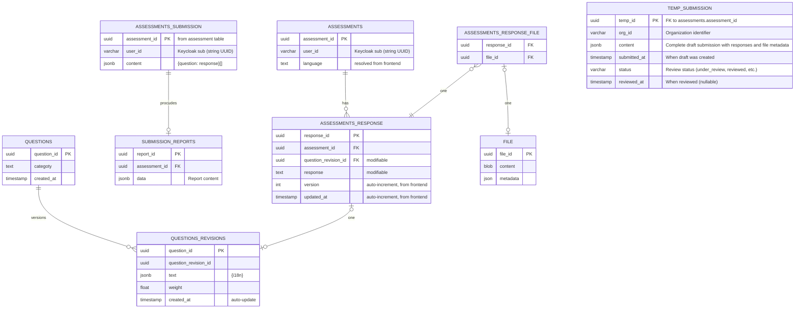

# Assessment System Data Model

This schema implements a version-safe assessment system with the following components:

## 1. Assessment Creation & Response Collection
- `ASSESSMENTS` creates a session for each user taking a test
- Users provide answers stored in `ASSESSMENTS_RESPONSE` (with version tracking for answer changes)
- File uploads are supported through `ASSESSMENTS_RESPONSE_FILE` → `FILE` relationship

## 2. Question Version Management
- `QUESTIONS` + `QUESTIONS_REVISIONS` ensure question edits don't affect existing assessments
- Each response links to a specific question revision, preserving historical accuracy

## 3. Draft Workflow & Temporary Submissions
- `TEMP_SUBMISSION` serves as a staging area for draft submissions before finalization
- Allows users to save assessment progress and review before final submission
- Contains complete assessment content including responses and file metadata
- Supports review workflow with status tracking (under_review, reviewed, etc.)
- Automatically cleaned up when moved to final submission

## 4. Submission & Reporting
- `ASSESSMENTS_SUBMISSION` creates an immutable snapshot when user submits
- `SUBMISSION_REPORTS` stores grading results and feedback tied to the submission

## Key Benefits
- ✅ **Immutable assessments** - completed tests remain unchanged even if questions are updated
- ✅ **Answer versioning** - tracks how responses evolve during the assessment
- ✅ **File attachment support** - handles document/image uploads
- ✅ **Draft workflow** - users can save progress and review before final submission
- ✅ **Review process** - supports approval workflow with status tracking
- ✅ **Audit trail** - complete history from draft to final grade

## Entity Relationships

## Implementation

The database schema follows the ER diagram and provides:
- Clean separation between mutable draft state and immutable submission
- Full version history of questions and answers
- Support for file attachments
- Comprehensive reporting capabilities
