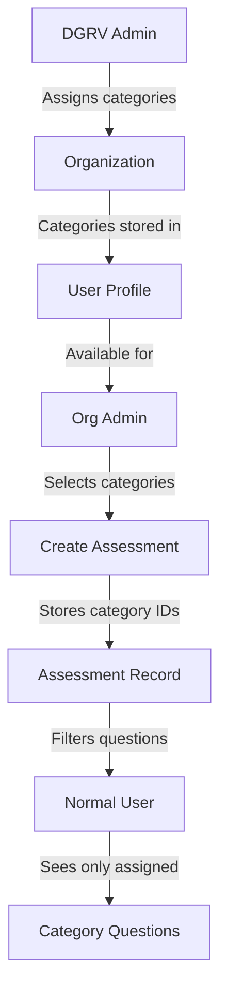

# Category Assignment Feature Implementation Plan

## Overview

This document outlines the implementation strategy for adding category assignment functionality to the DGAT Sustainability Assessment Platform. The feature enables organization administrators to assign specific categories to assessments during creation, allowing normal users to only answer questions from those assigned categories.

## Current Architecture Analysis

### Database Structure
- **Categories Table**: Stores category metadata (name, weight, order, template_id)
- **Assessments Table**: Stores assessment metadata (org_id, language, name)
- **Questions Table**: Stores questions with category references (currently via string field)
- **No direct assessment-category relationship exists**

### Key Findings
1. Questions are already categorized by string-based `category` field
2. Assessments currently don't have category associations
3. User categories are managed at the organization/user level
4. Frontend already filters questions by user-assigned categories

## Proposed Implementation Strategy

### Option Analysis

**Option 1: Many-to-Many Relationship Table**
- Create `assessment_categories` junction table
- Pros: Flexible, supports multiple categories per assessment
- Cons: Requires complex migrations and query changes

**Option 2: JSON Array Field in Assessments Table** ✅ **RECOMMENDED**
- Add `categories` JSONB column to assessments table
- Store array of category UUIDs
- Pros: Simple implementation, maintains data integrity
- Cons: Limited query flexibility for complex filtering

**Option 3: Assessment-Category Direct Relationship**
- Add `category_id` foreign key to assessments
- Pros: Simple, maintains referential integrity
- Cons: Only supports single category per assessment

## Chosen Implementation: JSON Array Field

We'll implement **Option 2** (JSON Array Field) as it provides the best balance of simplicity and functionality for the current use case.

## Implementation Steps

### 1. Database Migration
```sql
-- Add categories JSONB column to assessments table
ALTER TABLE assessments ADD COLUMN categories JSONB DEFAULT '[]'::JSONB;
```

### 2. Backend Changes

#### Update Assessment Model
```rust
// In backend/src/common/database/entity/assessments.rs
#[derive(Clone, Debug, PartialEq, DeriveEntityModel)]
#[sea_orm(table_name = "assessments")]
pub struct Model {
    #[sea_orm(primary_key, auto_increment = false)]
    pub assessment_id: Uuid,
    pub org_id: String,
    pub language: String,
    pub name: String,
    pub categories: Json, // New field
    pub created_at: DateTime<Utc>,
}
```

#### Update CreateAssessmentRequest
```rust
// In backend/src/web/api/models.rs
#[derive(Debug, Serialize, Deserialize)]
pub struct CreateAssessmentRequest {
    pub language: String,
    pub name: String,
    pub categories: Vec<Uuid>, // New field
}
```

#### Update Assessment Service
```rust
// In backend/src/common/database/entity/assessments.rs
pub async fn create_assessment(
    &self,
    org_id: String,
    language: String,
    name: String,
    categories: Vec<Uuid>, // New parameter
) -> Result<Model, DbErr> {
    let assessment = ActiveModel {
        assessment_id: Set(Uuid::new_v4()),
        org_id: Set(org_id),
        language: Set(language),
        name: Set(name),
        categories: Set(Json::from(categories)), // Store as JSON
        created_at: Set(Utc::now()),
    };
    // ... rest of method
}
```

### 3. Frontend Changes

#### Update CreateAssessmentModal
```typescript
// In frontend/src/components/shared/CreateAssessmentModal.tsx
interface CreateAssessmentModalProps {
  isOpen: boolean;
  onClose: () => void;
  onSubmit: (name: string, categories: string[]) => void; // Updated signature
  isLoading?: boolean;
  availableCategories?: Category[]; // New prop
}

// Add category selection UI in the modal
```

#### Update Assessment Creation Logic
```typescript
// In frontend/src/pages/user/Assesment.tsx
const handleCreateAssessment = async (assessmentName: string, selectedCategories: string[]) => {
  const newAssessment: CreateAssessmentRequest = { 
    language: currentLanguage,
    name: assessmentName,
    categories: selectedCategories, // New field
  };
  // ... rest of method
};
```

### 4. Category Filtering Logic

#### Update Question Filtering
```typescript
// In frontend/src/pages/user/Assesment.tsx
const getQuestionsForAssessment = (assessment: Assessment, allQuestions: Question[]) => {
  if (!assessment.categories || assessment.categories.length === 0) {
    return allQuestions; // Backward compatibility
  }
  
  return allQuestions.filter(question => 
    assessment.categories.includes(question.category)
  );
};
```

## Data Flow



## API Changes

### New Endpoints
- `GET /api/v1/organizations/{org_id}/categories` - Get assignable categories
- `PUT /api/v1/organizations/{org_id}/categories` - Update assignable categories

### Modified Endpoints
- `POST /api/v1/assessments` - Now accepts `categories` array
- `GET /api/v1/assessments/{id}` - Now returns `categories` array

## Security Considerations

1. **Permission Checks**: Only org_admins can assign categories
2. **Validation**: Ensure assigned categories exist and belong to organization
3. **Data Integrity**: Validate category UUIDs during assessment creation

## Migration Strategy

1. **Phase 1**: Add nullable categories field with backward compatibility
2. **Phase 2**: Update frontend to support category selection
3. **Phase 3**: Enforce category assignment for new assessments
4. **Phase 4**: Migrate existing data (optional)

## Testing Plan

### Unit Tests
- Assessment creation with categories
- Category validation
- Permission checks

### Integration Tests
- End-to-end assessment creation flow
- Question filtering based on assigned categories
- Organization category management

### User Acceptance Tests
- Org admin can assign categories during assessment creation
- Normal user only sees questions from assigned categories
- Error handling for invalid category assignments

## Rollback Plan

1. **Database**: The `categories` column is nullable, allowing rollback
2. **API**: Backward compatible with existing clients
3. **Frontend**: Graceful degradation if categories field missing

## Estimated Timeline

- **Database Changes**: 1 day
- **Backend Implementation**: 2 days
- **Frontend Implementation**: 3 days
- **Testing & QA**: 2 days
- **Total**: 8 business days

## Dependencies

1. Existing category management system
2. Organization/user role management
3. Question categorization system

## Risks & Mitigations

| Risk | Mitigation |
|------|------------|
| Data migration issues | Use nullable field, phased rollout |
| Performance impact on question filtering | Add proper indexing |
| Permission escalation | Strict role-based access control |
| Backward compatibility | Maintain old behavior when categories empty |

## Success Metrics

1. ✅ Org admins can successfully assign categories during assessment creation
2. ✅ Normal users only see questions from assigned categories
3. ✅ No regression in existing assessment functionality
4. ✅ Performance impact < 5% on question loading

## Future Enhancements

1. **Bulk Operations**: Assign categories to multiple assessments
2. **Category Templates**: Pre-defined category sets
3. **Advanced Filtering**: Category-based reporting and analytics
4. **Category Inheritance**: Organization-level default categories

---

*Implementation Plan Created: 2025-09-16*
*Target Completion: 2025-09-24*