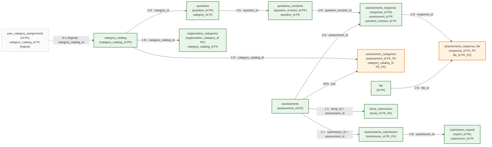

# Database Architecture & Schema — DGAT Sustainability Tool

## 1. Overview

The application uses two isolated **PostgreSQL 17** databases:

| Database | Purpose | Container | Host port |
|----------|---------|-----------|-----------|
| `sustainability` | All application data (assessments, responses, submissions, reports, questions, categories, files, user-category assignments) | `sustainability-db` | `127.0.0.1:5431` |
| `keycloak` | Keycloak identity data (users, roles, sessions, organizations) | `sustainability-keycloak-db` | `127.0.0.1:5433` |

Splitting the databases keeps identity data isolated from application data and
matches Keycloak's supported deployment model. Both databases share the same
`POSTGRES_USER`/`POSTGRES_PASSWORD` from `.env` for simplicity but store
their data in independent Docker volumes (`postgres-data` and
`keycloak-postgres-data`), so each can be backed up and restored independently.

The application database schema is managed by **SeaORM migrations** (the
`db-migrator` binary) and applied automatically on every stack startup by the
one-shot `sustainability-migrate` container.

---

## 2. Entity Overview

All entities live under `backend/src/common/database/entity/`. They are grouped
into four logical areas:

```
 ┌─────────────────── Reference data (admin-managed) ───────────────────┐
 │  category_catalog      questions        questions_revisions          │
 └──────┬──────────────────────┬──────────────────┬────────────────────┘
        │                      │                  │
 ┌──────▼───────────────── Org scoping ───────────▼─────────────────┐
 │  organization_categories      assessment_categories               │
 │  user_category_assignments                                        │
 └──────┬──────────────────────────────────────────────────────────┘
        │
 ┌──────▼──────────────── Assessment lifecycle ──────────────────────┐
 │  assessments → assessments_response → assessments_submission        │
 │                       │                  → submission_reports       │
 │                       → assessments_response_file                   │
 │  temp_submission (drafts)                                           │
 └────────────────────────────────────────────────────────────────────┘
┌────────────────────── Files ─────────────────────────────────────┐
  │  file  ←── assessments_response_file ──→ assessments_response      │
  └────────────────────────────────────────────────────────────────────┘
 ```

### 2.1 ER Diagram

The diagram below shows every table in the `sustainability` database and the
relationships (cardinality) between them. Cardinality notation follows crow's
foot: `||` = "one and only one", `|o` = "zero or one", `}o` = "zero or many",
`}|` = "one or many".

```mermaid
erDiagram
    category_catalog ||--o{ questions : "1:N category_id"
    category_catalog ||--o{ organization_categories : "1:N category_catalog_id"
    category_catalog ||--o{ assessment_categories : "1:N category_catalog_id"

    questions ||--o{ questions_revisions : "1:N question_id"

    questions_revisions ||--o{ assessments_response : "1:N question_revision_id"
    assessments ||--o{ assessments_response : "1:N assessment_id"

    assessments }o--o{ assessment_categories : "M:N join"
    assessments ||--o| assessments_submission : "1:1 submission_id=assessment_id"
    assessments ||--o| temp_submission : "1:1 temp_id=assessment_id"

    assessments_submission ||--o{ submission_reports : "1:N submission_id"

    assessments_response ||--o{ assessments_response_file : "1:N response_id"
    file ||--o{ assessments_response_file : "1:N file_id"

    user_category_assignments }o--|| category_catalog : "N:1 category_catalog_id (logical)"

    category_catalog {
        UUID category_catalog_id PK
        string name
        string description
        JSONB name_translations
        JSONB description_translations
        string template_id
        bool is_active
        timestamptz created_at
        timestamptz updated_at
    }
    questions {
        UUID question_id PK
        UUID category_id FK
        bool is_active
        int display_order
        timestamptz created_at
    }
    questions_revisions {
        UUID question_revision_id PK
        UUID question_id FK
        JSONB text
        float weight
        timestamptz created_at
    }
    assessments {
        UUID assessment_id PK
        string org_id
        string language
        string name
        timestamptz created_at
    }
    assessments_response {
        UUID response_id PK
        UUID assessment_id FK
        UUID question_revision_id FK
        string response
        int version
        timestamptz updated_at
    }
    assessment_categories {
        UUID assessment_id PK_FK
        UUID category_catalog_id PK_FK
    }
    organization_categories {
        UUID organization_category_id PK
        string keycloak_organization_id
        UUID category_catalog_id FK
        int weight
        int order
        timestamptz created_at
        timestamptz updated_at
    }
    user_category_assignments {
        UUID id PK
        string keycloak_org_id
        string keycloak_user_id
        UUID category_catalog_id FK
        timestamptz assigned_at
    }
    assessments_submission {
        UUID submission_id PK_FK
        string org_id
        string org_name
        JSONB content
        timestamptz submitted_at
        enum status
        timestamptz reviewed_at
    }
    temp_submission {
        UUID temp_id PK_FK
        string org_id
        JSONB content
        timestamptz submitted_at
        enum status
        timestamptz reviewed_at
    }
    submission_reports {
        UUID report_id PK
        UUID submission_id FK
        string report_type
        string status
        timestamptz generated_at
        JSONB data
    }
    file {
        UUID id PK
        bytea content
        JSONB metadata
    }
    assessments_response_file {
        UUID response_id PK_FK
        UUID file_id PK_FK
    }
```

> `PK` = primary key, `FK` = foreign key, `PK_FK` = column that is both part of
> the primary key and a foreign key. Logical relations (e.g.
> `user_category_assignments → category_catalog`) are enforced by application
> logic, not by a database FK constraint.

### 2.2 Relationship Map (flowchart)

A simpler, box-and-arrow view of how every table links to every other table.
Each arrow is labelled with the cardinality (`1:N`, `1:1`, `M:N`) and the
foreign-key column used to join them.



### 2.3 Relationship Summary

| # | Parent (1 side) | Child (many side) | Cardinality | FK column on child | Join / notes |
|---|-----------------|------------------|-------------|--------------------|--------------|
| 1 | `category_catalog` | `questions` | 1:N | `questions.category_id` | A category owns many questions |
| 2 | `category_catalog` | `organization_categories` | 1:N | `organization_categories.category_catalog_id` | Org-specific assignment of a global category |
| 3 | `category_catalog` | `assessment_categories` | 1:N | `assessment_categories.category_catalog_id` | Half of the M:N join below |
| 4 | `assessments` | `assessment_categories` | 1:N | `assessment_categories.assessment_id` | Other half of the M:N join |
| 5 | `assessments` ↔ `category_catalog` | via `assessment_categories` | **M:N** | (join table) | An assessment scopes many categories; a category appears on many assessments |
| 6 | `questions` | `questions_revisions` | 1:N | `questions_revisions.question_id` | Immutable revision snapshots (i18n text + weight) |
| 7 | `questions_revisions` | `assessments_response` | 1:N | `assessments_response.question_revision_id` | An answer pins a specific question revision |
| 8 | `assessments` | `assessments_response` | 1:N | `assessments_response.assessment_id` | Versioned answers belonging to one assessment |
| 9 | `assessments` | `assessments_submission` | **1:1** | `assessments_submission.submission_id` = `assessments.assessment_id` | One finalized submission per assessment |
| 10 | `assessments` | `temp_submission` | **1:1** | `temp_submission.temp_id` = `assessments.assessment_id` | One in-progress draft per assessment |
| 11 | `assessments_submission` | `submission_reports` | 1:N | `submission_reports.submission_id` | Generated reports per submission |
| 12 | `assessments_response` | `assessments_response_file` | 1:N | `assessments_response_file.response_id` | Half of the M:N response↔file join |
| 13 | `file` | `assessments_response_file` | 1:N | `assessments_response_file.file_id` | Other half of the M:N response↔file join |
| 14 | `assessments_response` ↔ `file` | via `assessments_response_file` | **M:N** | (join table) | An answer may attach many files; a file may be reused across answers |
| 15 | `category_catalog` | `user_category_assignments` | N:1 (logical) | `user_category_assignments.category_catalog_id` | Logical — no DB FK; enforced by app logic |

---

## 3. Entity-by-Entity Reference

### 3.1 `assessments`

Assessment headers — one per assessment created for an organization.

| Column | Type | Notes |
|--------|------|-------|
| `assessment_id` | UUID (PK, manual) | Primary key |
| `org_id` | String | Keycloak organization id (tenant scoping) |
| `language` | String | Assessment language code |
| `name` | String | Assessment name (added by migration `m20250731`) |
| `created_at` | timestamptz | Creation timestamp |

**Relations:** → `assessments_response` (1:N), → `assessments_submission` (1:1),
→ `assessment_categories` (1:N join to `category_catalog`).

### 3.2 `assessments_response`

One row per (assessment, question revision, version) — answers are versioned.

| Column | Type | Notes |
|--------|------|-------|
| `response_id` | UUID (PK) | Primary key |
| `assessment_id` | UUID (FK) | Owning assessment |
| `question_revision_id` | UUID (FK) | Specific revision of the question answered |
| `response` | String | The answer payload |
| `version` | i32 | Version number; latest is `MAX(version)` per question |
| `updated_at` | timestamptz | Last update timestamp |

**Relations:** → `assessments` (N:1), → `questions_revisions` (N:1),
→ `assessments_response_file` (1:N).

### 3.3 `questions`

The question bank. A question is linked to a single category and toggled active
or inactive.

| Column | Type | Notes |
|--------|------|-------|
| `question_id` | UUID (PK) | Primary key |
| `category_id` | UUID (FK) | References `category_catalog` |
| `is_active` | bool | Added by migration `m20260331` |
| `display_order` | i32 | Ordering (added by `m20260401`) |
| `created_at` | timestamptz | |

**Relations:** → `questions_revisions` (1:N), → `category_catalog` (N:1).

### 3.4 `questions_revisions`

Immutable revision snapshots of a question's text and weight. This supports
multilingual text (JSONB) and historical accuracy of responses.

| Column | Type | Notes |
|--------|------|-------|
| `question_revision_id` | UUID (PK) | Primary key |
| `question_id` | UUID (FK) | Owning question |
| `text` | JSONB | i18n question text (e.g. `{"en": "...", "fr": "..."}`) |
| `weight` | f32 | Scoring weight |
| `created_at` | timestamptz | Revision timestamp |

**Relations:** → `questions` (N:1), → `assessments_response` (1:N).

### 3.5 `category_catalog`

Global, admin-managed category catalog. Multilingual via JSONB translations
(added by `m20260601`). A `template_id` groups categories that belong to the
same assessment template.

| Column | Type | Notes |
|--------|------|-------|
| `category_catalog_id` | UUID (PK) | Primary key |
| `name` | String | Default name |
| `description` | String? | Default description |
| `name_translations` | JSONB | `{"en":"...","fr":"..."}` |
| `description_translations` | JSONB | Same shape |
| `template_id` | String | Assessment template group |
| `is_active` | bool | Soft-active flag |
| `created_at` / `updated_at` | timestamptz | |

**Relations:** → `organization_categories` (1:N), → `assessment_categories`
(1:N), → `questions` (1:N).

### 3.6 `organization_categories`

A category from the global catalog assigned to a specific organization, with an
org-specific weight and display order.

| Column | Type | Notes |
|--------|------|-------|
| `organization_category_id` | UUID (PK) | |
| `keycloak_organization_id` | String | Keycloak org id (tenant) |
| `category_catalog_id` | UUID (FK) | → `category_catalog` |
| `weight` | i32 | 1–100; org-specific weight |
| `order` | i32 | Display order within the org |
| `created_at` / `updated_at` | timestamptz | |

**Relations:** → `category_catalog` (N:1).

### 3.7 `user_category_assignments`

Maps a Keycloak user to the category catalog entries they are allowed to
assess for a given organization. Supports org-admin assigning assessors to
specific categories.

| Column | Type | Notes |
|--------|------|-------|
| `id` | UUID (PK) | |
| `keycloak_org_id` | String | Keycloak org id |
| `keycloak_user_id` | String | Keycloak user id |
| `category_catalog_id` | UUID (FK) | → `category_catalog` |
| `assigned_at` | timestamptz | |

**Relations:** none (standalone mapping table).

> Note: the initial migration (`m20260420_000001`) used a different key shape;
> `m20260420_000002` migrated the table to the UUID-based `category_catalog_id`
> to avoid casing issues with text keys.

### 3.8 `assessment_categories`

Join table linking an assessment to one or more categories from the catalog
(the assessment's category scope). Added by `m20250917`.

| Column | Type | Notes |
|--------|------|-------|
| `assessment_id` | UUID (FK, PK part) | → `assessments` |
| `category_catalog_id` | UUID (FK, PK part) | → `category_catalog` |

**Relations:** → `assessments` (N:1), → `category_catalog` (N:1).

### 3.9 `assessments_submission`

A finalized submission for an assessment. The `submission_id` is also the
foreign key back to `assessments.assessment_id` (1:1).

| Column | Type | Notes |
|--------|------|-------|
| `submission_id` | UUID (PK, FK→assessments) | |
| `org_id` | String | Keycloak org id |
| `org_name` | String | Denormalized (added by `m20251104`) |
| `content` | JSONB | All answers snapshot |
| `submitted_at` | timestamptz | |
| `status` | enum | `under_review` / `reviewed` (added by `m20250715_000011`) |
| `reviewed_at` | timestamptz? | (added by `m20250715_000012`) |

**Relations:** → `assessments` (1:1), → `submission_reports` (1:N).

> A unique constraint ensures one submission per assessment
> (`m20260424_000001`).

### 3.10 `temp_submission`

Draft submissions (in-progress submissions not yet finalized).

| Column | Type | Notes |
|--------|------|-------|
| `temp_id` | UUID (PK, FK→assessments) | |
| `org_id` | String | Keycloak org id |
| `content` | JSONB | Draft answers snapshot |
| `submitted_at` | timestamptz | |
| `status` | enum | Review status (mirrors submission) |
| `reviewed_at` | timestamptz? | |

**Relations:** → `assessments` (1:1). Created by `m20250819`.

### 3.11 `submission_reports`

Generated report rows per submission. Added/evolved by `m20250706_000008` and
updated by `m20250715_000013`.

| Column | Type | Notes |
|--------|------|-------|
| `report_id` | UUID (PK) | |
| `submission_id` | UUID (FK) | → `assessments_submission` |
| `report_type` | String | Report kind |
| `status` | String | Generation status |
| `generated_at` | timestamptz | |
| `data` | JSONB? | Report content (nullable) |

**Relations:** → `assessments_submission` (N:1). A unique constraint
(`m20260424_000002`) prevents duplicate report rows.

### 3.12 `file`

Binary file blobs with JSON metadata.

| Column | Type | Notes |
|--------|------|-------|
| `id` | UUID (PK) | |
| `content` | bytea | File contents |
| `metadata` | JSONB | Filename, content type, etc. |

**Relations:** → `assessments_response_file` (1:N).

### 3.13 `assessments_response_file`

Many-to-many join between responses and files.

| Column | Type | Notes |
|--------|------|-------|
| `response_id` | UUID (PK part, FK) | → `assessments_response` |
| `file_id` | UUID (PK part, FK) | → `file` |

**Relations:** → `assessments_response` (N:1), → `file` (N:1).

---

## 4. JSONB Usage

Several columns use `JSONB` to store flexible, multilingual, or polymorphic
data:

| Table.Column | Purpose |
|--------------|---------|
| `questions_revisions.text` | i18n question text (`{"en":"...", "fr":"..."}`) |
| `category_catalog.name_translations` | i18n category name |
| `category_catalog.description_translations` | i18n category description |
| `assessments_submission.content` | Snapshot of all answers at submission time |
| `temp_submission.content` | Draft answer snapshot |
| `submission_reports.data` | Generated report payload (nullable) |
| `file.metadata` | File metadata (name, mime, size) |
| `assessments_response.response` | String but historically flex-shaped answer |

Top level multilingual pairs are defined in `frontend/src/i18n/locales/`
(`<lang>.json`). The backend persists locale-tagged JSONB and the frontend
selects the right translation at render time.

---

## 5. Migration History

Migrations live in `backend/src/common/migrations/` and are registered in
`mod.rs` via the `Migrator` struct. They are applied in the listed order at
startup via the `db-migrator` binary (`src/bin/db_migrator.rs`).

| Migration | What it does |
|-----------|-------------|
| `m20250706_000001` | Creates `questions` |
| `m20250706_000002` | Creates `questions_revisions` |
| `m20250706_000003` | Creates `assessments` |
| `m20250706_000004` | Creates `assessments_response` |
| `m20250706_000005` | Creates `file` |
| `m20250706_000006` | Creates `assessments_response_file` |
| `m20250706_000007` | Creates `assessments_submission` |
| `m20250706_000008` | Creates `submission_reports` |
| `m20250706_000010` | Removes FK from assessment submission |
| `m20250715_000011` | Adds `status` to submissions |
| `m20250715_000012` | Adds `reviewed_at` to submissions |
| `m20250715_000013` | Updates `submission_reports` |
| `m20250123_000014` | Creates legacy `categories` table |
| `m20250124_000016` | Creates `category_catalog` |
| `m20250124_000017` | Creates `organization_categories` |
| `m20250124_000018` | Migrates categories → catalog |
| `m20250731_000001` | Adds `name` to assessments |
| `m20250819_000015` | Creates `temp_submission` |
| `m20250916_000016` | Adds categories to assessments |
| `m20250917_000017` | Creates `assessment_categories` join |
| `m20251010_082000` | Refactors question–category link |
| `m20251104_153200` | Adds `org_name` to submissions |
| `m20260331_114000` | Adds `is_active` to questions |
| `m20260401_091000` | Adds `display_order` to questions |
| `m20260420_000001` | Creates `user_category_assignments` |
| `m20260420_000002` | Alters `user_category_assignments` to use UUID id |
| `m20260424_000001` | Adds unique constraint on `assessments_submission` |
| `m20260424_000002` | Adds unique constraint on `submission_reports` |
| `m20260601_000001` | Adds `translations` JSONB to `category_catalog` |

### Applying migrations in production

Migrations run automatically via the `migrate` service in
`docker-compose.prod.yml`, which `depends_on: db (healthy)` and exits before the
backend starts (`depends_on: migrate (service_completed_successfully)`).
Because SeaORM tracks applied migrations in the `seql_migrations` metadata
table, re-runs are idempotent. To run migrations manually:

```bash
docker compose run --rm migrate
# or, locally:
cd backend && cargo run --bin db-migrator
```

> There is no automated downgrade path — migrations are forward-only. If a
> rollback is needed, restore the previous backup (see BACKUP_RESTORE.md).

---

## 6. Keycloak database

The `keycloak` database schema is fully owned and managed by Keycloak itself.
The application never reads from or writes to it directly. It is backed up as a
raw `pg_dump` and restored whole (see BACKUP_RESTORE.md). Keycloak also exports
the realm to JSON via the Admin REST API as a secondary safety net.

---

## 7. Indexing & performance notes

- Primary keys are UUIDs (manually generated, `auto_increment = false`), so
  inserts are distributed and do not suffer a hot sequence page.
- The most frequent filters used by the service layer are: `org_id`
  (assessments, submissions, temp submissions, user_category_assignments),
  `question_revision_id` (responses), `category_id` / `is_active`
  (questions), `keycloak_organization_id` (organization_categories). If
  performance on large datasets becomes an issue, index these columns or add
  partial indexes on `is_active = true` filters.
- JSONB columns allow flexible answers but no structural indexes exist yet;
  avoid heavy server-side JSONB aggregation beyond report generation.