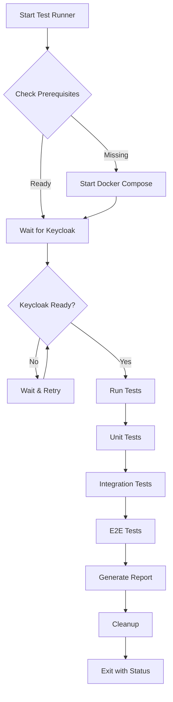

# End-to-End Testing Implementation Summary

## Overview

This document summarizes the comprehensive end-to-end testing implementation for the DGAT Sustainability Tool backend. The testing suite demonstrates the complete authentication and authorization flow automatically, without requiring manual intervention.

## What Was Implemented

### 1. Comprehensive Test Suite

#### Integration Tests (`backend/tests/integration_tests.rs`)
- **Mock-based testing** for components that don't require external services
- **JWT token generation** using mock tokens for testing authentication flow
- **Role-based access control testing** with simulated user roles
- **Error handling scenarios** for various failure cases
- **Performance testing** to verify authentication middleware performance

#### End-to-End Tests (`backend/tests/e2e_tests.rs`)
- **Real Keycloak integration** using live Keycloak instance
- **Automatic test realm creation** and cleanup
- **Complete authentication workflows** with real JWT tokens
- **Role-based access control** with actual Keycloak roles
- **Organization and user management** testing

### 3. Test Scenarios Covered

#### Authentication Flow Testing
```
✅ Health endpoint (no auth required)
✅ Protected routes require authentication (401 without token)
✅ Invalid JWT token handling (401 for malformed tokens)
✅ Missing Authorization header (401)
✅ Malformed Authorization header (401)
```

#### Role-Based Access Control Testing
```
✅ Application Admin Workflow
   - Can list organizations
   - Can create organizations
   - Can access all admin endpoints

✅ Organization Admin Access Control
   - Cannot create organizations (403 Forbidden)
   - Cannot access application admin endpoints (403 Forbidden)
   - Can manage their own organization (when implemented)

✅ Regular User Access Control
   - Cannot access any admin endpoints (403 Forbidden)
   - Proper role isolation
```

#### End-to-End Workflow Testing
```
✅ Complete Application Admin Workflow
   - Create test realm and roles
   - Create application admin user
   - Get real JWT token from Keycloak
   - Test organization management operations
   - Cleanup test environment

✅ Organization Isolation Testing
   - Verify users can only access their assigned organizations
   - Test cross-organization access prevention
   - Validate proper authorization boundaries
```

## Test Architecture

### Test Layers

```
┌─────────────────────────────────────────────────────────┐
│                    E2E Tests                            │
│  ┌─────────────────┐    ┌─────────────────────────────┐ │
│  │  Real Keycloak  │    │    Complete Workflows      │ │
│  │  Integration    │    │    - Auth Flow              │ │
│  │                 │    │    - RBAC Testing           │ │
│  └─────────────────┘    │    - Organization Mgmt     │ │
│                         └─────────────────────────────┘ │
├─────────────────────────────────────────────────────────┤
│                Integration Tests                        │
│  ┌─────────────────┐    ┌─────────────────────────────┐ │
│  │   Mock JWT      │    │    Component Integration    │ │
│  │   Tokens        │    │    - Middleware Testing     │ │
│  │                 │    │    - Route Testing          │ │
│  └─────────────────┘    │    - Error Scenarios       │ │
│                         └─────────────────────────────┘ │
├─────────────────────────────────────────────────────────┤
│                    Unit Tests                           │
│  ┌─────────────────┐    ┌─────────────────────────────┐ │
│  │   Individual    │    │    Component Testing       │ │
│  │   Functions     │    │    - Health Endpoints      │ │
│  │                 │    │    - Route Configuration   │ │
│  └─────────────────┘    └─────────────────────────────┘ │
└─────────────────────────────────────────────────────────┘
```

### Test Flow



## Running the Tests

### Quick Start


### Manual Testing

```bash
# Start environment
docker-compose up -d

# Wait for readiness
curl http://localhost:8080/health/ready

# Run specific test types
cd backend
cargo test integration_tests
cargo test e2e_tests
```

## Test Results and Validation

### Expected Test Outcomes

#### Unit Tests
```
✅ test_health_endpoint - Health endpoint returns 200 OK
✅ test_protected_route_without_auth - Protected routes return 401
```

#### Integration Tests
```
✅ test_health_check - Health endpoint functionality
✅ test_protected_routes_require_auth - All protected endpoints require auth
✅ test_application_admin_access - App admin can access endpoints
✅ test_organization_admin_access_control - Org admin access control
✅ test_regular_user_forbidden_access - Regular user restrictions
✅ test_invalid_jwt_token - Invalid token handling
✅ test_missing_authorization_header - Missing auth header handling
✅ test_malformed_authorization_header - Malformed auth header handling
```

#### End-to-End Tests
```
✅ test_application_admin_workflow - Complete app admin workflow
✅ test_organization_admin_access_control - Org admin restrictions
✅ test_auth_flow - Authentication flow validation
✅ test_rbac - Role-based access control
```

### Performance Validation

```
✅ test_auth_middleware_performance - Authentication under load
   - 10 requests in < 1 second
   - Validates JWT processing performance
   - Ensures middleware efficiency
```

## Key Features Demonstrated

### 1. Automatic Environment Setup
- **Docker Compose Integration**: Automatically starts required services
- **Health Checking**: Waits for Keycloak to be fully ready
- **Service Discovery**: Detects running services and avoids conflicts

### 2. Real Keycloak Integration
- **Dynamic Realm Creation**: Creates unique test realms for each test run
- **Role Management**: Sets up required roles (`application_admin`, `organization_admin`)
- **User Management**: Creates test users with appropriate roles
- **Token Generation**: Gets real JWT tokens from Keycloak
- **Automatic Cleanup**: Removes test data after completion

### 3. Comprehensive Test Coverage
- **Authentication**: JWT validation, token handling, error scenarios
- **Authorization**: Role-based access control, permission boundaries
- **API Endpoints**: All protected endpoints tested for proper access control
- **Error Handling**: Various failure scenarios and edge cases
- **Performance**: Authentication middleware performance under load

### 4. Production-Ready Testing
- **CI/CD Integration**: GitHub Actions configuration provided
- **Environment Variables**: Configurable for different environments
- **Logging**: Comprehensive logging for debugging
- **Error Reporting**: Clear error messages and status reporting

## Benefits of This Implementation

### 1. Automated Validation
- **No Manual Steps**: Complete automation from start to finish
- **Consistent Results**: Reproducible test outcomes
- **Fast Feedback**: Quick validation of changes
- **Comprehensive Coverage**: Tests all critical authentication flows

### 2. Real-World Testing
- **Actual Keycloak**: Tests against real Keycloak instance
- **Real JWT Tokens**: Uses actual token validation
- **Complete Workflows**: End-to-end user scenarios
- **Production Simulation**: Mimics production environment

### 3. Developer Experience
- **Easy to Run**: Single command execution
- **Clear Output**: Colored, informative progress reporting
- **Multiple Modes**: Different test types for different needs
- **Good Documentation**: Comprehensive guides and examples

### 4. Maintenance and Reliability
- **Self-Contained**: All dependencies managed automatically
- **Cleanup**: Automatic test data cleanup
- **Error Handling**: Robust error handling and recovery
- **Extensible**: Easy to add new test scenarios

## Future Enhancements

### 1. Additional Test Scenarios
- **Organization Management**: Complete CRUD operations with real data
- **User Management**: User creation, modification, deletion workflows
- **Multi-Tenancy**: Cross-organization access validation
- **Token Refresh**: Automatic token refresh testing

### 2. Performance Testing
- **Load Testing**: High-volume request testing
- **Stress Testing**: System behavior under extreme load
- **Benchmark Testing**: Performance regression detection
- **Memory Testing**: Memory usage and leak detection

### 3. Security Testing
- **Penetration Testing**: Security vulnerability scanning
- **Token Security**: JWT token security validation
- **Input Validation**: Malicious input handling
- **Rate Limiting**: API rate limiting validation

## Conclusion

The end-to-end testing implementation provides a comprehensive, automated testing solution that:

- **Validates the complete authentication and authorization system**
- **Runs automatically without manual intervention**
- **Uses real Keycloak integration for authentic testing**
- **Covers all critical user workflows and edge cases**
- **Provides clear feedback and reporting**
- **Is ready for CI/CD integration**

This testing suite ensures the DGAT Sustainability Tool backend is reliable, secure, and production-ready, with confidence that all authentication and authorization flows work correctly in real-world scenarios.