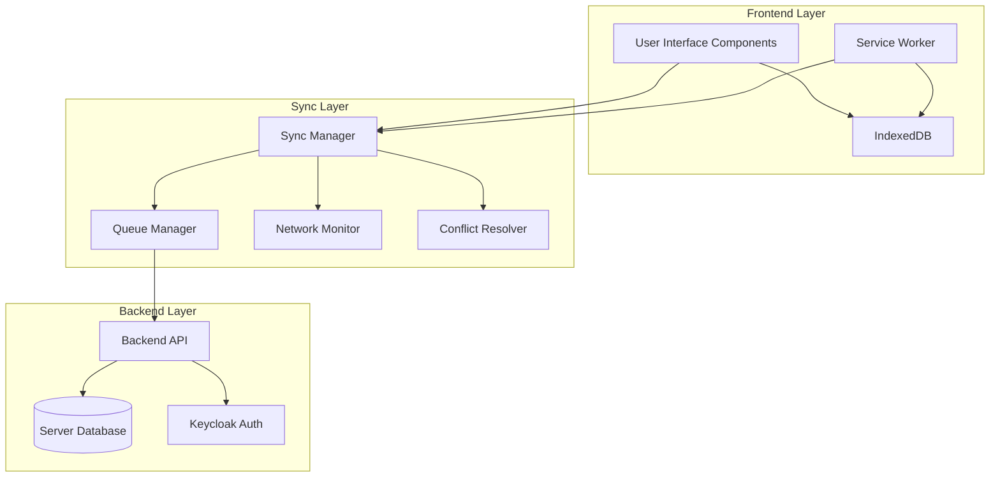
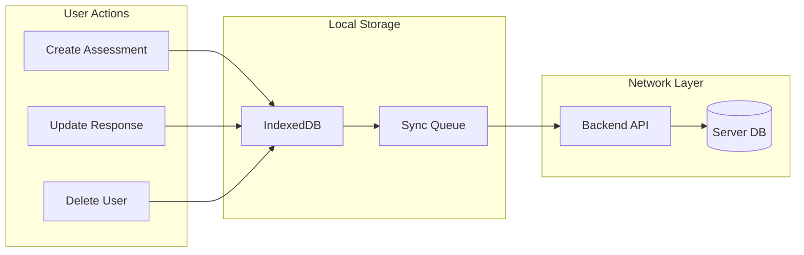
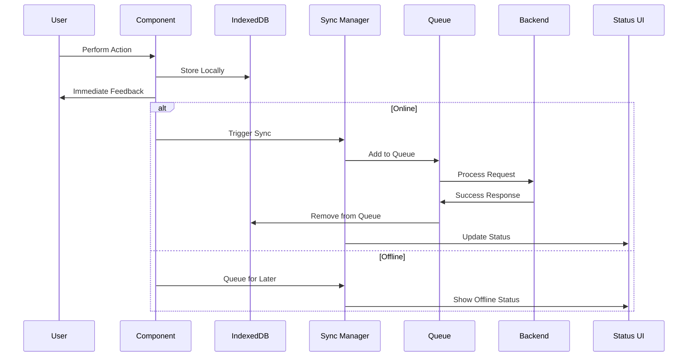

# Offline-First Architecture for DGAT Sustainability Tool

## Table of Contents
1. [Executive Summary](#executive-summary)
2. [Architecture Overview](#architecture-overview)
3. [Core Components](#core-components)
4. [Data Flow](#data-flow)
5. [Implementation Strategy](#implementation-strategy)
6. [Technical Specifications](#technical-specifications)
7. [User Experience](#user-experience)
8. [Case Scenarios](#case-scenarios)
9. [Architecture Diagrams](#architecture-diagrams)
10. [Success Metrics](#success-metrics)

---

## Executive Summary

The DGAT Sustainability Tool implements a comprehensive **offline-first architecture** that enables users to perform all assessment activities without internet connectivity. The system provides seamless data synchronization, robust conflict resolution, and real-time status feedback to ensure a consistent user experience regardless of network conditions.

### Key Features
- **Offline-First Data Access**: All data operations prioritize local storage
- **Background Synchronization**: Automatic sync when connectivity is restored
- **Conflict Resolution**: Last-write-wins strategy for data conflicts
- **Real-time Status**: Visual indicators for sync status and network connectivity
- **Queue Persistence**: Offline operations survive browser restarts
- **Role-Based Data Loading**: Initial data pull based on user permissions

---

## Architecture Overview

### High-Level Architecture

```
┌─────────────────┐    ┌─────────────────┐    ┌─────────────────┐
│   Frontend UI   │    │  IndexedDB      │    │   Backend API   │
│   Components    │◄──►│  (Local Cache)  │◄──►│   (Server DB)   │
└─────────────────┘    └─────────────────┘    └─────────────────┘
         │                       │                       │
         │              ┌─────────────────┐              │
         └──────────────►│  Sync Service   │◄─────────────┘
                        │  (Queue Mgmt)   │
                        └─────────────────┘
```

### Core Principles

1. **Single Source of Truth**: IndexedDB serves as the primary data source for all components
2. **Immediate Persistence**: All user actions are stored locally first
3. **Background Processing**: Network operations happen transparently in the background
4. **Graceful Degradation**: Full functionality available offline
5. **Automatic Recovery**: Seamless transition between online/offline states

---

## Core Components

### 1. Enhanced IndexedDB Schema

#### Data Storage Strategy
The offline database will store all essential data types required for the sustainability assessment tool. This includes core assessment data such as questions and categories, user-specific data like assessments and responses, and organizational data for administrators including users, organizations, submissions, and reports.

The database structure is designed with proper indexing to ensure fast queries and efficient data retrieval. Each data type has specific indexes based on common query patterns, such as filtering assessments by user or organization, or finding responses for a specific assessment.

#### Sync Queue Management
The sync queue is a critical component that manages all pending operations that need to be synchronized with the server. Each queue item contains detailed information about the operation type, the data being modified, and metadata for retry logic and conflict resolution.

The queue system implements a robust retry mechanism with exponential backoff to handle temporary network failures. Failed operations are automatically retried with increasing delays, and operations that exceed the maximum retry count are moved to a separate failed items list for manual review.

### 2. Request Interceptor Layer

#### Operation Flow Strategy
The request interceptor acts as a middleware that intercepts all API calls and routes them through the offline-first strategy. For read operations, the system first checks the local database and returns data immediately, then optionally updates the local cache with fresh data from the server if the user is online.

For write operations, the system immediately stores the data locally and provides instant feedback to the user. The operation is then queued for synchronization with the server when connectivity is available. This approach ensures that users never experience delays due to network issues.

#### Component Integration
All React components are modified to read data directly from the local database instead of making direct API calls. This ensures consistent behavior regardless of network status and provides a seamless user experience. The interceptor layer handles the complexity of data synchronization transparently.

### 3. Background Sync Service

#### Network Monitoring
The sync service continuously monitors network connectivity using multiple detection methods. It listens for browser online/offline events and also performs periodic connectivity checks to ensure accurate status detection. The service maintains detailed logs of network status changes for debugging and analytics.

#### Queue Processing Strategy
When the network becomes available, the sync service automatically processes all pending queue items. The processing follows a first-in-first-out order with priority handling for critical operations. Each operation is processed individually with proper error handling and retry logic.

The service provides real-time feedback about sync progress and handles various error scenarios gracefully. Failed operations are automatically retried with exponential backoff, and persistent failures are logged for manual intervention.

#### Conflict Resolution Framework
The system implements a last-write-wins conflict resolution strategy based on server timestamps. When conflicts are detected, the server version takes precedence, ensuring data consistency across all devices. The conflict resolution process is transparent to users and maintains data integrity.

### 4. Status Management

#### Network Status Tracking
The system maintains detailed information about network connectivity, including connection type, last online timestamp, and connection quality metrics. This information is used for optimizing sync strategies and providing accurate status feedback to users.

#### Sync Status Monitoring
Real-time sync status tracking provides users with immediate feedback about the synchronization process. The system tracks pending operations, failed items, sync progress, and overall system health. This information is displayed through various UI components to keep users informed.

---

## Data Flow

### 1. Initial Data Loading (On Login)

The initial data loading process is triggered immediately after successful user authentication. The system determines the user's role and permissions, then fetches all necessary data based on their access level.

For organization administrators, the system loads comprehensive data including all questions, categories, assessments within their organization, user information, and submission reports. Regular users receive a more focused dataset including questions, categories, their own assessments, and submissions.

The data loading process is optimized to minimize initial load time while ensuring all necessary information is available for offline operation. The system provides progress indicators during the loading process and handles errors gracefully.

### 2. Offline Operation Flow

When users perform actions while offline, the system immediately stores the changes locally and provides instant feedback. The operation is automatically queued for synchronization when connectivity is restored.

The queue system ensures that no data is lost during offline operation and maintains the order of operations. Each queued item contains sufficient information to recreate the operation on the server, including all necessary metadata and context.

### 3. Background Sync Process

The background sync process runs continuously when the network is available, processing queued operations in the background without interrupting user workflow. The process includes comprehensive error handling and retry logic to ensure reliable synchronization.

Sync progress is communicated to users through status indicators and notifications, keeping them informed about the synchronization state without being intrusive. The system handles various network conditions and server responses appropriately.

---

## Implementation Strategy

### Phase 1: Enhanced IndexedDB Schema
The first phase focuses on establishing the foundation by extending the current database schema to include all necessary data types. This involves creating new object stores for users, organizations, submissions, and reports, along with proper indexing for efficient queries.

The sync queue structure is implemented with robust retry logic and proper error handling. Status tracking tables are added to monitor sync progress and network connectivity. This phase ensures that all data can be stored locally and accessed efficiently.

### Phase 2: Request Interceptor
The second phase implements the request interceptor layer that routes all API calls through the offline-first strategy. Components are updated to read from the local database instead of making direct API calls, ensuring consistent behavior regardless of network status.

Mutation handling is implemented to support offline-first operations, with proper queue management and conflict resolution preparation. This phase establishes the core offline functionality and ensures that users can work seamlessly without network connectivity.

### Phase 3: Background Sync Service
The third phase implements the background synchronization service with comprehensive network monitoring and queue processing capabilities. The service includes automatic retry logic with exponential backoff and proper error handling.

Conflict resolution is implemented using the last-write-wins strategy, ensuring data consistency across all devices. The service provides real-time status updates and handles various network conditions gracefully.

### Phase 4: User Interface
The final phase focuses on user experience improvements, including real-time status indicators, progress bars for sync operations, and user-friendly error messages. The interface provides clear feedback about system status and guides users through any necessary actions.

Error handling is enhanced with graceful degradation and recovery options. The system provides comprehensive feedback about sync status, network connectivity, and any issues that require user attention.

---

## Technical Specifications

### 1. Data Storage Strategy

#### Database Configuration
The IndexedDB database is configured with multiple object stores, each optimized for specific data types and query patterns. The database includes comprehensive indexing to ensure fast data retrieval and efficient storage utilization.

The database versioning system allows for schema evolution while maintaining backward compatibility. Each object store is designed with appropriate key paths and indexes based on common access patterns and performance requirements.

#### Data Freshness Management
The system implements a replace strategy for data synchronization, where entire datasets are replaced during sync operations to ensure consistency. Server timestamps are used for conflict detection and resolution, providing a reliable mechanism for maintaining data integrity.

The system tracks data freshness through timestamps and version numbers, allowing for efficient incremental updates in future enhancements. This approach ensures that users always have access to the most current data while maintaining offline functionality.

### 2. Queue Management

#### Queue Operations
The queue management system provides comprehensive operations for adding, processing, retrying, and clearing queue items. The system maintains detailed statistics about queue performance and provides monitoring capabilities for debugging and optimization.

Queue items are processed with proper error handling and retry logic, ensuring that no operations are lost due to temporary network issues. The system provides detailed logging and monitoring capabilities for tracking queue performance and identifying potential issues.

#### Retry Logic Implementation
The retry system implements exponential backoff with configurable parameters including maximum retry attempts, base delay, maximum delay, and backoff multiplier. This approach ensures efficient resource utilization while providing reliable operation processing.

Failed operations are automatically retried with increasing delays, and operations that exceed the maximum retry count are moved to a separate failed items list for manual review. The system provides comprehensive error reporting and recovery options.

### 3. Conflict Resolution

#### Last-Write-Wins Strategy
The conflict resolution system implements a last-write-wins strategy based on server timestamps, ensuring that the most recent data takes precedence. This approach provides a simple and reliable mechanism for maintaining data consistency across multiple devices.

The system includes comprehensive conflict detection mechanisms that compare local and server data to identify potential conflicts. When conflicts are detected, the system automatically resolves them using the predefined strategy and provides appropriate feedback to users.

#### Conflict Detection Mechanisms
The system uses timestamp comparison as the primary method for conflict detection, with server timestamps taking precedence over local timestamps. Version tracking is implemented for optimistic locking, providing additional protection against concurrent modifications.

The system is designed to support future enhancements including field-level merging for complex conflicts and manual conflict resolution for critical data. This extensible approach ensures that the system can evolve to meet changing requirements.

---

## User Experience

### 1. Status Indicators

#### Visual Status Components
The system provides comprehensive visual indicators for network status, sync progress, and system health. These indicators are designed to be informative without being intrusive, providing users with immediate feedback about system status.

The status bar component displays real-time information about network connectivity, sync status, and pending operations. The component uses color coding and icons to provide quick visual feedback, with detailed information available on hover or click.

#### Status States
The system defines clear visual states for different system conditions, including online, offline, syncing, and error states. Each state is represented with appropriate colors, icons, and messaging to ensure clear communication with users.

The status system provides progressive disclosure of information, showing basic status at a glance with detailed information available when needed. This approach ensures that users can quickly understand system status while having access to detailed information when required.

### 2. User Feedback

#### Notification System
The system implements a comprehensive notification system that provides timely feedback about sync operations, network status changes, and system events. Notifications are designed to be informative and actionable, helping users understand what's happening and what actions they might need to take.

Toast notifications provide immediate feedback for user actions and system events, with appropriate styling and timing to ensure visibility without being disruptive. The notification system includes different types for different levels of importance and user action requirements.

#### Loading States
The system provides clear loading states for all operations, including initial data loading, sync operations, and user actions. Loading indicators are designed to be informative and reassuring, helping users understand that the system is working on their behalf.

Loading states include progress indicators where appropriate, providing users with a sense of progress and estimated completion time. The system handles various loading scenarios gracefully, including network timeouts and partial failures.

### 3. Error Handling

#### Graceful Degradation
The system implements comprehensive error handling that ensures graceful degradation when network or server issues occur. Users are provided with clear information about what went wrong and what actions they can take to resolve the issue.

Error messages are designed to be user-friendly and actionable, avoiding technical jargon while providing sufficient information for problem resolution. The system includes automatic recovery mechanisms where possible, reducing the need for manual intervention.

#### Recovery Options
The system provides multiple recovery options for different types of errors, including automatic retry, manual retry, and alternative workflows. Users are guided through recovery processes with clear instructions and progress indicators.

The error handling system includes comprehensive logging for debugging and support purposes, while maintaining user privacy and security. Error reports include sufficient context for problem resolution without exposing sensitive information.

---

## Case Scenarios

### Scenario 1: Org Admin Working Offline

#### Context
An organization administrator needs to review assessments and manage users while traveling with intermittent connectivity. They need to access comprehensive organizational data and perform administrative functions without reliable internet access.

#### User Journey
The administrator logs into the application and the system automatically loads all necessary data including questions, categories, assessments within their organization, user information, and submission reports. This initial loading process ensures that all administrative functions are available offline.

During offline work, the administrator can review existing assessments, create new assessments, add responses to questions, and manage user permissions. All actions are immediately stored locally and queued for synchronization when connectivity is restored.

When network connectivity returns, the system automatically synchronizes all changes in the background, providing real-time feedback about sync progress. Any conflicts are resolved using the last-write-wins strategy, ensuring data consistency.

#### Technical Flow
The system follows a comprehensive flow from initial data loading through offline operation to background synchronization. The process ensures data integrity while providing seamless user experience regardless of network conditions.

### Scenario 2: Field Assessment with Poor Connectivity

#### Context
A field worker conducting sustainability assessments in rural areas with unreliable internet needs to complete assessments without interruption, even when connectivity is completely unavailable.

#### User Journey
The field worker pre-loads assessment data before going to the field, ensuring that all necessary questions, categories, and assessment templates are available locally. This preparation enables complete offline operation during field work.

During field assessments, the worker can complete full assessments without any connectivity requirements. All responses are immediately stored locally and queued for synchronization. The system provides immediate feedback for all actions, ensuring confidence in data capture.

When brief connectivity is available, the system performs partial synchronization, processing as many queued operations as possible within the available connection time. Remaining operations remain queued for future sync opportunities.

When reliable connection is restored, the system performs complete synchronization, ensuring all data is properly transmitted to the server. The system provides comprehensive feedback about sync status and any issues that require attention.

#### Technical Flow
The system implements a robust pre-loading strategy followed by complete offline operation and intelligent partial synchronization. This approach maximizes productivity in challenging network environments.

### Scenario 3: Multi-Device Synchronization

#### Context
A user works on assessments across multiple devices including desktop computers, tablets, and mobile phones, requiring consistent data across all devices regardless of which device was used for modifications.

#### User Journey
The user creates an assessment on their desktop computer while offline, with the system immediately storing the data locally and queuing it for synchronization. When connectivity is restored, the assessment is automatically synced to the server.

On a tablet device, the user accesses the same assessment and makes additional changes. The system loads the latest data from the server and stores local modifications. When conflicts are detected, the last-write-wins strategy ensures data consistency.

The system maintains data consistency across all devices by using server timestamps for conflict resolution. All devices reflect the latest changes, ensuring that users can seamlessly switch between devices without data loss or inconsistency.

#### Technical Flow
The system implements comprehensive cross-device synchronization with robust conflict resolution, ensuring data consistency and user confidence in multi-device workflows.

---

## Architecture Diagrams

### System Architecture Diagram



### Data Flow Architecture



### Component Interaction Diagram



---

## Success Metrics

### Technical Metrics
- **Offline Functionality**: 100% of core features available offline
- **Sync Reliability**: 99%+ successful sync rate
- **Performance**: <2s initial load time, <500ms local operations
- **Data Integrity**: Zero data loss during offline/online transitions

### User Experience Metrics
- **User Satisfaction**: >90% satisfaction with offline experience
- **Error Rate**: <1% sync failures requiring user intervention
- **Adoption**: >80% of users utilize offline features
- **Support Tickets**: <5% of tickets related to sync issues

---

## Conclusion

This offline-first architecture provides a robust, user-friendly solution for the DGAT Sustainability Tool, ensuring that users can work effectively regardless of network conditions. The implementation prioritizes data integrity, user experience, and system reliability while maintaining the flexibility to evolve with future requirements.

The architecture is designed to be scalable, maintainable, and extensible, allowing for future enhancements such as advanced conflict resolution, real-time collaboration, and cross-device synchronization. 