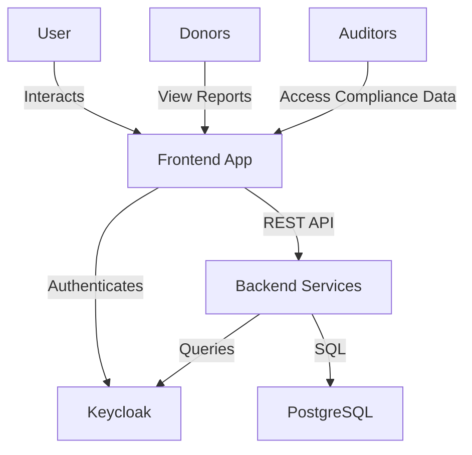
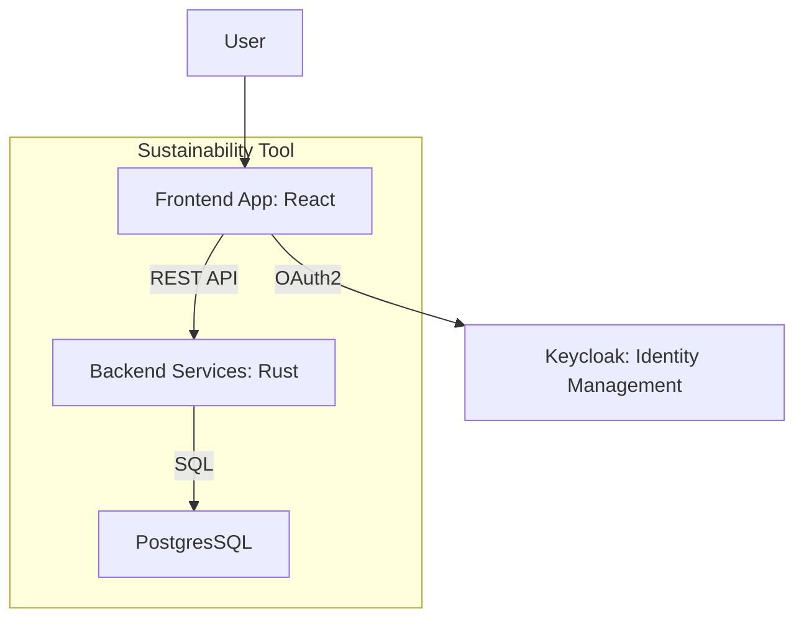
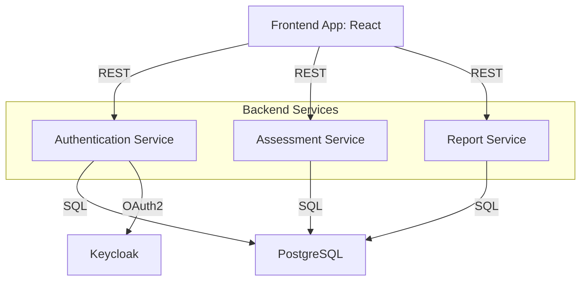
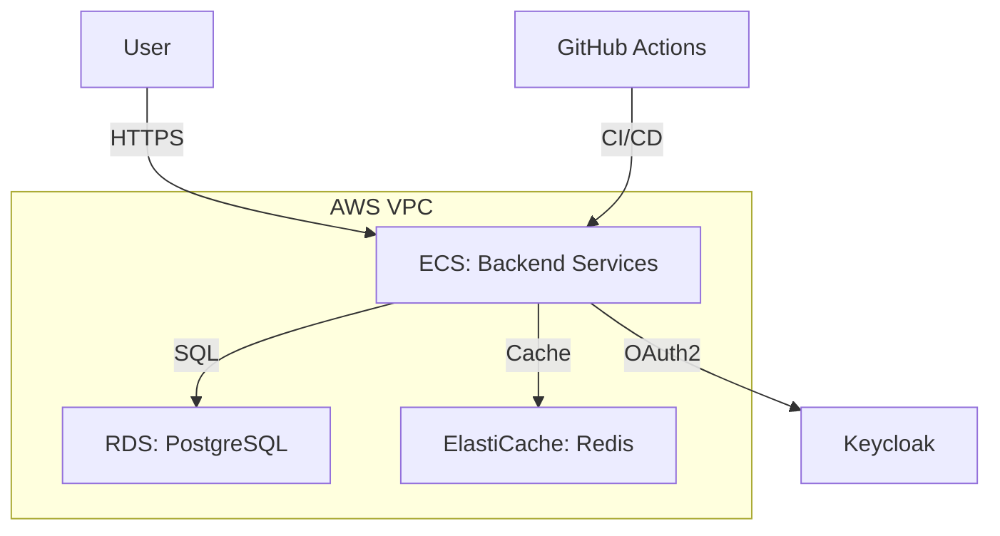
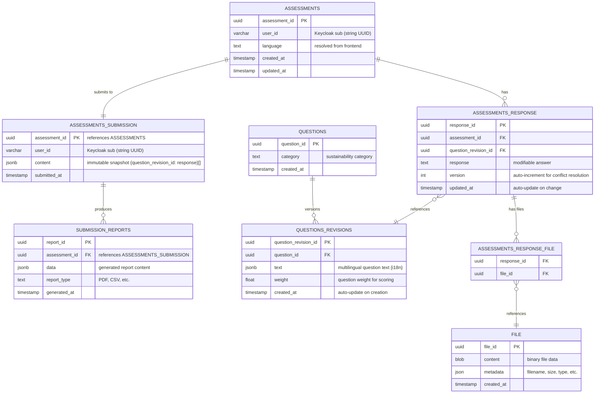

# Arc42 Documentation 

## 1. Introduction and Goals

The Sustainability Tool enables cooperative organizations, such as the National Cooperative Federation of Eswatini (NCFE) and DGRV Southern Africa, to assess sustainability across Institutional, Environmental, Social, and Governance aspects, based on the DGRV Sustainability Measurement Tool. It supports offline and online operations, multilingual question sets, and report generation in PDF and CSV formats. Integrated with Keycloak for secure identity management, the tool ensures scalability, security, and usability for multiple organizations.

### Goals

- **Facilitate Assessments**: Support structured ESG assessments with weighted questions.
- **Enable Offline Functionality**: Allow data entry and synchronization in disconnected environments.
- **Ensure Security**: Protect data with encryption and role-based access control.
- **Generate Actionable Reports**: Provide PDF/CSV reports for stakeholders.
- **Support Multi-Tenancy**: Manage isolated data for multiple organizations.

### Requirements Overview

- **Functional**: Create/edit assessments, manage questions, synchronize offline data, generate reports.
- **Non-Functional**: High availability, GDPR compliance, multilingual support, responsive UI.

*Cross-reference: See Section 2 for constraints and Section 9 for technical choices.*

## 2. Constraints

### Technical Constraints

- **Identity Management**: Integrate with Keycloak, using user_id (VARCHAR, Keycloak sub), organization_id, and organization categories in JWT attributes (within the organizations section).
- **Database**: PostgresSQL with JSONB for flexible storage of answers and multilingual text.
- **Encryption**: AES-256 for sensitive JSONB data.
- **Security**: PostgresSQL row-level security for user-specific access.
- **Performance**: GIN indexes on JSONB fields for query optimization.
- **Frontend**: React with Tailwind CSS, implemented as a Progressive Web Application with assets cached in the device browser.
- **Backend**: Rust microservices with RESTful APIs.

### Organizational Constraints

- **Multi-Tenancy**: Support organizations like NCFE with isolated data.
- **Questionnaire**: Align with DGRV's sustainability categories (Institutional, Environmental, Social, Governance).
- **Donor Compliance**: Adhere to donor reporting requirements.

### Legal Constraints

- **Data Protection**: Comply with GDPR and Eswatini data regulations.

*Cross-reference: See Section 3 for system boundaries and Section 8 for security details.*

## 3. Context and Scope

### Context Diagram (C4 System Context)

### Scope

- **In Scope**: Assessment management, question authoring, offline synchronization, report generation, multilingual support.
- **Out of Scope**: User account creation (Keycloak), external auditing processes.

*Cross-reference: See Section 5 for components and Section 6 for interactions.*

## 4. Solution Strategy

The system employs a modular, cloud-native architecture:

- **Frontend**: React with Tailwind CSS for a responsive, offline-capable UI.
- **Backend**: Rust microservices for scalability and maintainability.
- **Database**: PostgreSQL with JSONB for flexible storage, optimized with relational design.
- **Authentication**: Keycloak for secure identity management.
- **Synchronization**: Queue-based mechanism for offline/online data sync.
- **Reporting**: PDF/CSV generation aligned with DGRV metrics.
- **Deployment**: AWS with CI/CD for rapid iteration.

**Justification**: This approach ensures scalability, supports DGRV's complex questionnaire, and meets offline and security requirements.

*Cross-reference: See Section 9 for detailed decisions and Section 11 for quality goals.*

## 5. Building Block View

### Level 1: Container Diagram (C4)

### Level 2: Component Diagram (C4)

### Components

#### Frontend Application Architecture:
- Built with React, using JSX and Tailwind CSS for styling.
- Offline storage via IndexedDB for assessments and application assets.
- Features: Authentication, assessment creation/editing, synchronization, report viewing.
- Application assets are stored in the device browser for offline functionality.

#### Backend API Design and Microservices Structure:
- **Authentication Service**: Validates Keycloak JWT tokens.
- **Assessment Service**: Manages CRUD for assessments and questions.
- **Sync Service**: Processes offline changes using versioning in ASSESSMENTS_RESPONSE for conflict resolution.
- **Report Service**: Generates PDF/CSV reports.
- Built with Rust, exposing RESTful APIs.

#### Database Schema and Data Flow:
- **ASSESSMENTS**: Stores assessment_id (UUID PK), user_id (VARCHAR, Keycloak sub), language (TEXT, resolved from frontend), created_at and updated_at timestamps.
- **ASSESSMENTS_RESPONSE**: Stores response_id (UUID PK), assessment_id (UUID FK), question_revision_id (UUID FK), response (TEXT, modifiable answer), updated_at (TIMESTAMP, auto-update on change and used for conflict resolution).
- **ASSESSMENTS_RESPONSE_FILE**: Junction table linking response_id (UUID FK) to file_id (UUID FK) for file attachments.
- **ASSESSMENTS_SUBMISSION**: Stores assessment_id (UUID PK), user_id (VARCHAR, Keycloak sub), content (JSONB, immutable snapshot of question_revision_id: response pairs), submitted_at (TIMESTAMP).
- **FILE**: Stores file_id (UUID PK), content (BLOB, binary file data stored directly in the database), metadata (JSON, filename, size, type, etc.), created_at (TIMESTAMP).
- **QUESTIONS**: Stores question_id (UUID PK), category (TEXT, sustainability category), created_at (TIMESTAMP).
- **QUESTIONS_REVISIONS**: Stores question_revision_id (UUID PK), question_id (UUID FK), text (JSONB, multilingual question text), weight (FLOAT, question weight for scoring), created_at (TIMESTAMP, auto-update on creation).
- **SUBMISSION_REPORTS**: Stores report_id (UUID PK), assessment_id (UUID FK to ASSESSMENTS_SUBMISSION), data (JSONB, generated report content), report_type (TEXT, PDF, CSV, etc.), generated_at (TIMESTAMP).
- **Data Flow**: Users create assessments stored in ASSESSMENTS with responses in ASSESSMENTS_RESPONSE. Questions are versioned through QUESTIONS_REVISIONS. Upon completion, assessments are submitted as immutable snapshots in ASSESSMENTS_SUBMISSION. Reports are generated from submissions and stored in SUBMISSION_REPORTS. File attachments are managed through FILE table with junction table ASSESSMENTS_RESPONSE_FILE.

#### Keycloak Integration:
- Manages user identities and roles.
- Provides JWT with user_id and organization_id.
- Organization categories are included in the JWT token within the organizations section, allowing role-based access to specific assessment categories.

*Cross-reference: See Section 6 for runtime scenarios and Section 7 for deployment details.*

## 6. Runtime View

### Scenario 1: Keycloak Authentication Flow
1. User navigates to frontend, redirected to Keycloak login.
2. Keycloak issues JWT with user_id (VARCHAR), organization_id, and organization categories (JWT attributes in organizations section).
3. Frontend stores token, uses it for API requests.
4. Authentication service validates token with Keycloak.

### Scenario 2: Offline/Online Synchronization
1. User creates/edits assessment offline.
2. Data stored in IndexedDB.
3. Response changes tracked with timestamps for conflict resolution.
4. When online, frontend sends changes to sync service.
5. Sync service updates ASSESSMENTS_RESPONSE, resolving conflicts by comparing timestamps and keeping the most recent changes.

### Scenario 3: Report Generation
1. User submits completed assessment.
2. Assessment data is stored as immutable snapshot in ASSESSMENTS_SUBMISSION.
3. Frontend calls report service API.
4. Service fetches data from ASSESSMENTS_SUBMISSION, generates PDF/CSV, stores in SUBMISSION_REPORTS.
5. Frontend provides download link.

*Cross-reference: See Section 5 for components and Section 8 for sync details.*

## 7. Deployment View

### Deployment Diagram (C4)

### Deployment and DevOps Pipeline

#### Infrastructure:
- **Frontend**: Progressive Web Application with assets cached in the device browser.
- **Backend**: Rust microservices on ECS with auto-scaling.
- **Database**: RDS PostgreSQL with automated backups and multi-AZ, storing all application data including files.
- **Keycloak**: Managed instance for high availability.
- **Caching**: ElastiCache (Redis) for performance.

#### CI/CD Pipeline:
- **Version Control**: GitHub for source code.
- **Build**: GitHub Actions builds Docker images for backend services.
- **Test**: Automated unit and integration tests.
- **Deploy**: Images pushed to ECR, deployed to ECS via GitHub Actions.
- **Monitoring**: Centralized logging and metrics system, with alerts for failures.

#### Environments:
- **Development**: Local Dockerized setup.
- **Staging**: AWS with anonymized data.
- **Production**: High-availability setup.

*Cross-reference: See Section 10 for deployment risks.*

## 8. Cross-cutting Concepts

### Security:
- TLS for API communication.
- AES-256 encryption for JSONB fields.
- PostgreSQL row-level security.
- Keycloak role-based access control.

### Performance:
- GIN indexes on JSONB fields (data, text, answer).
- Redis caching for frequent queries.
- Asynchronous report generation.

### Internationalization:
- JSONB for multilingual question text (e.g., {'en': 'Text', 'fr': 'Texte'}).
- Frontend language switching.

### Offline/Online Synchronization:
- IndexedDB for local storage of data and application assets.
- Service Workers for caching application assets in the browser.
- Timestamp-based conflict resolution in ASSESSMENTS_RESPONSE.
- Conflict resolution via timestamp comparison, with the most recent changes taking precedence.

### Logging/Monitoring:
- Centralized logging and metrics system.
- Audit logs for user actions.

*Cross-reference: See Section 9 for justifications.*

## 9. Design Decisions

| Decision | Justification                                                         | Alternatives Considered |
|----------|-----------------------------------------------------------------------|------------------------|
| Keycloak Integration | Simplifies authentication, supports multi-tenancy via JWT with organization categories in organizations section, enabling role-based access control to specific assessment categories. | Custom auth (higher maintenance). |
| JSONB in PostgreSQL | Flexible for DGRV's questionnaire and multilingual text.              | Relational tables (less adaptable). |
| React with Tailwind CSS | Responsive UI, rapid development.                                     | Angular (complexer setup). |
| Microservices Architecture | Scalability, independent deployment.                                  | Monolith (less flexible). |
| Timestamp-based Conflict Resolution | Reliable offline sync with timestamp-based conflict resolution in ASSESSMENTS_RESPONSE. | Real-time sync (requires connectivity). |
| AWS Deployment | Scalable, managed services.                                           | On-premises (higher costs). |
| Rust Backend | Memory safety, performance, concurrency. and low resource utilisation | Node.js (higher memory usage). |

*Cross-reference: See Section 4 for strategy and Section 11 for quality impacts.*

## 10. Risks and Technical Debt

### Risks
- **Sync Conflicts**: Mitigated by timestamp-based last-write-wins approach.
- **JSONB Performance**: Addressed with GIN indexes.
- **Keycloak Downtime**: Mitigated with redundant instances.
- **Scalability Limits**: Monitored via centralized metrics system.

### Technical Debt
- **Unused Questions**: Periodic cleanup of QUESTIONS.
- **Timestamp Conflict Resolution**: Timestamp conflicts in ASSESSMENTS_RESPONSE may require monitoring and additional resolution strategies for edge cases.

*Cross-reference: See Section 7 for mitigation strategies.*

## 11. Quality Requirements

| Quality | Description | Scenario |
|---------|-------------|----------|
| Performance | API response <500ms. | 100-question assessment submission. |
| Scalability | Support 1,000 concurrent users. | Multiple organizations submit simultaneously. |
| Security | Data encryption, access control. | Unauthorized access attempt. |
| Usability | Intuitive UI, offline support. | Offline assessment and sync. |
| Maintainability | Modular design for updates. | Add new question category. |

*Cross-reference: See Section 9 for design impacts.*

## 12. Glossary

| Term | Definition |
|------|------------|
| DGRV | German Cooperative and Raiffeisen Confederation. |
| ESG | Environmental, Social, Governance criteria. |
| Keycloak | Identity and access management system. |
| JSONB | PostgreSQL binary JSON format. |
| Timestamp-based Conflict Resolution | Mechanism for handling concurrent edits using timestamps in ASSESSMENTS_RESPONSE. |

## Database ER Diagram

