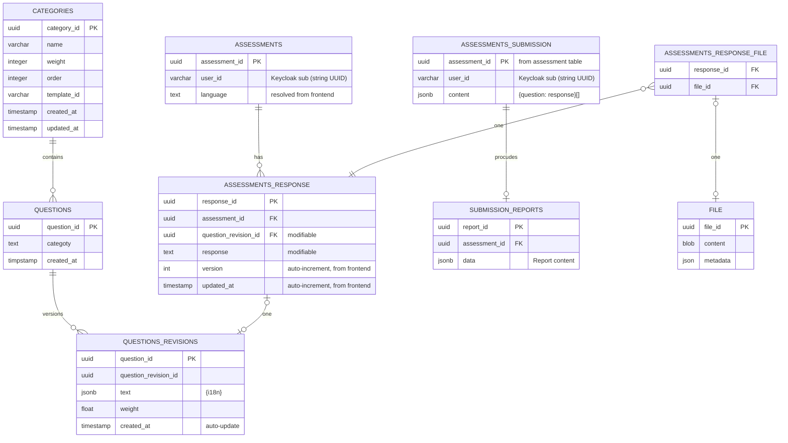

## Database ER Diagram

```mermaid
erDiagram
    CATEGORIES ||--o{ QUESTIONS : "contains"
    ASSESSMENTS ||--o{ ASSESSMENTS_RESPONSE : "has"
    ASSESSMENTS_SUBMISSION ||--o| SUBMISSION_REPORTS : "procudes"
    QUESTIONS  || --o{ QUESTIONS_REVISIONS : "versions"
    ASSESSMENTS_RESPONSE |o--o| QUESTIONS_REVISIONS : "one"
    ASSESSMENTS_RESPONSE_FILE }o--|| ASSESSMENTS_RESPONSE : "one"
    ASSESSMENTS_RESPONSE_FILE |o--o| FILE : "one"

    ASSESSMENTS_SUBMISSION {
        uuid assessment_id PK "from assessment table"
        varchar user_id "Keycloak sub (string UUID)"
        jsonb content "{question: response}[]"
    }

    ASSESSMENTS {
        uuid assessment_id PK
        varchar user_id "Keycloak sub (string UUID)"
        text language "resolved from frontend"
    }

    ASSESSMENTS_RESPONSE {
        uuid response_id PK
        uuid assessment_id FK
        uuid question_revision_id FK "modifiable"
        text response "modifiable"
        int version "auto-increment, from frontend"
        timestamp updated_at "auto-increment, from frontend"
    }

    ASSESSMENTS_RESPONSE_FILE {
        uuid response_id FK
        uuid file_id FK
    }

    FILE {
        uuid file_id PK
        blob content
        json metadata
    }

    QUESTIONS {
        uuid question_id PK
        text categoty
        timpstamp created_at
    }

    QUESTIONS_REVISIONS {
        uuid question_id PK
        uuid question_revision_id
        jsonb text "{i18n}"
        float weight
        timestamp created_at "auto-update"
    }

    SUBMISSION_REPORTS {
        uuid report_id PK
        uuid assessment_id FK
        jsonb data "Report content"
    }
    
    CATEGORIES {
        uuid category_id PK
        varchar name
        integer weight
        integer order
        varchar template_id
        timestamp created_at
        timestamp updated_at
    }
```
