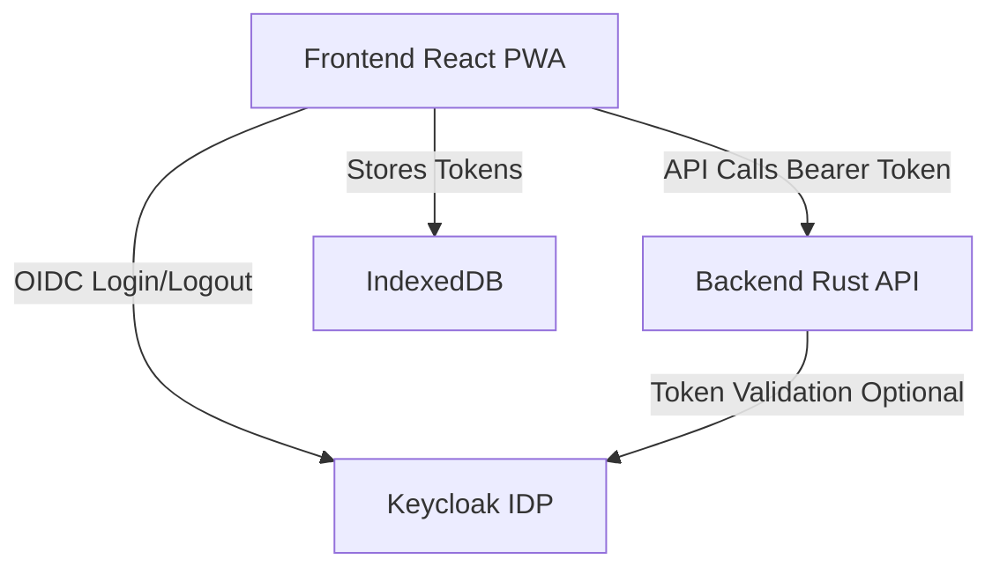
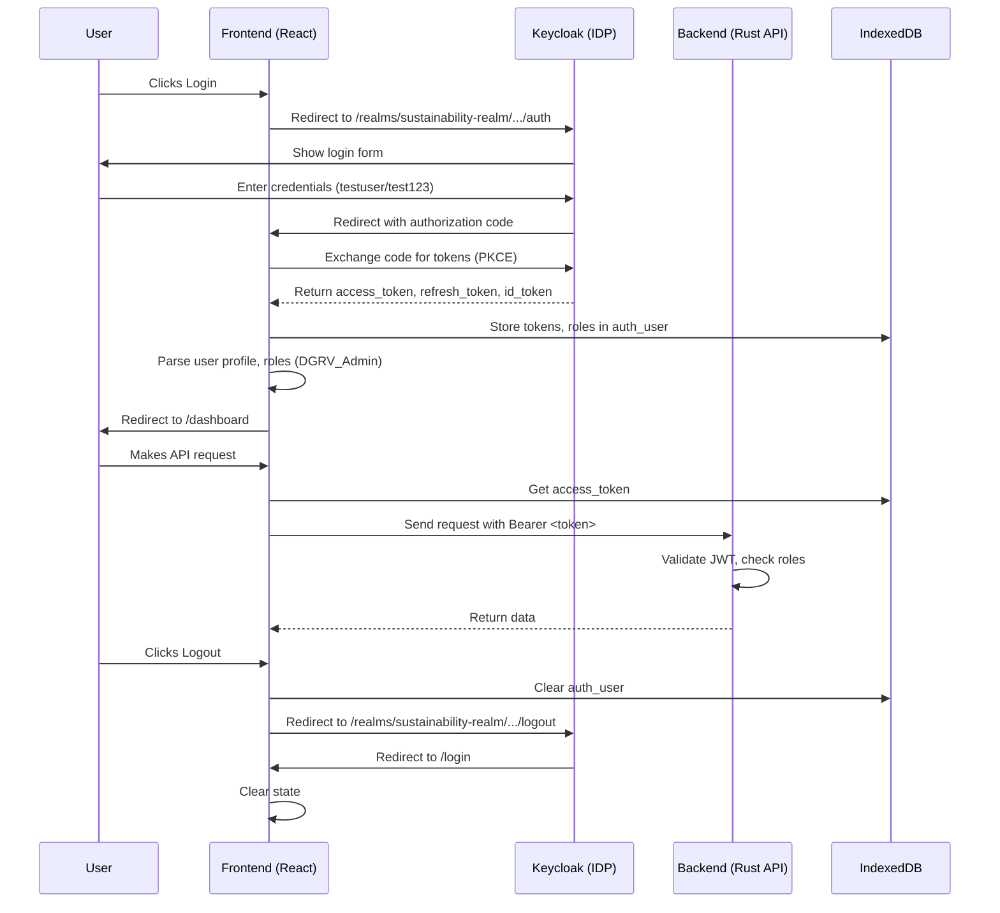
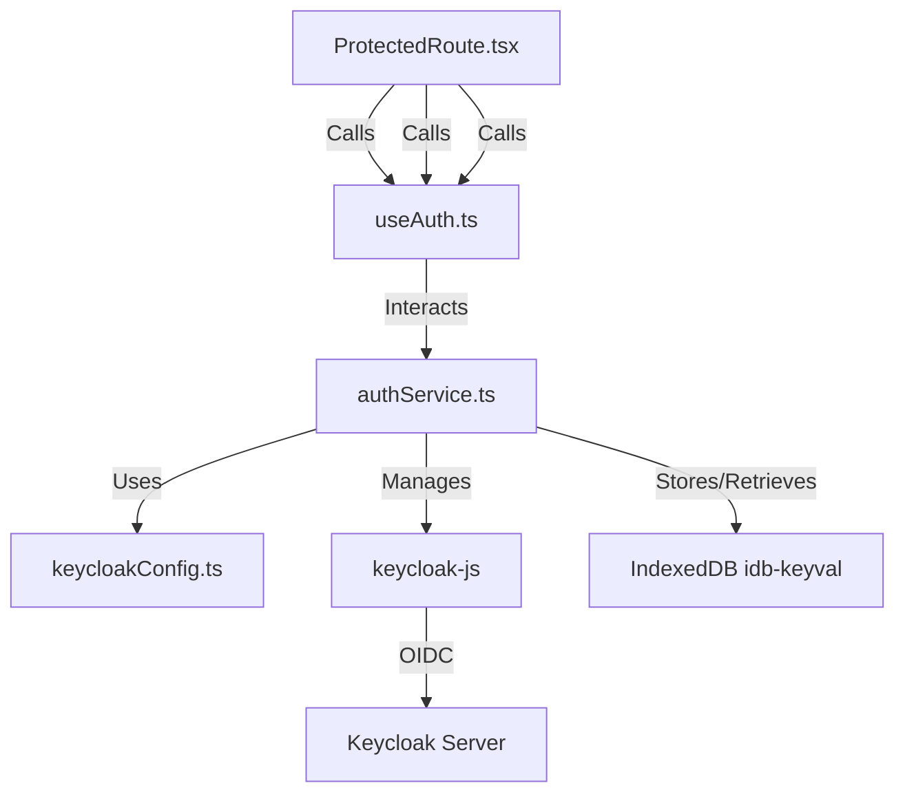

# Keycloak Authentication Guide for Sustainability Assessment Tool

This document provides a comprehensive, clear, and professional guide to integrating Keycloak authentication and authorization into the Sustainability Assessment Tool, a React-based Progressive Web App (PWA) with an offline-first architecture and a Rust-based backend. The application uses the official `keycloak-js` library for authentication, providing a stable and secure authentication experience.

## Table of Contents

- [Keycloak Authentication Guide for Sustainability Assessment Tool](#keycloak-authentication-guide-for-sustainability-assessment-tool)
  - [Table of Contents](#table-of-contents)
  - [Overview](#overview)
  - [Architecture Overview](#architecture-overview)
    - [Architecture Diagram](#architecture-diagram)
  - [Authentication Sequence Diagram](#authentication-sequence-diagram)
  - [Component Interaction Diagram](#component-interaction-diagram)
  - [Flow Description](#flow-description)
    - [Login](#login)
    - [Authenticated API Call](#authenticated-api-call)
    - [Logout](#logout)
  - [Architecture & Key Files](#architecture--key-files)
  - [Security Best Practices](#security-best-practices)

## Overview

The Sustainability Assessment Tool uses [Keycloak](https://www.keycloak.org/) for secure authentication and role-based access control (RBAC) via the OpenID Connect (OIDC) Authorization Code Flow with Proof Key for Code Exchange (PKCE). The `keycloak-js` library handles frontend authentication, providing a stable and secure authentication experience. Key features include:

- **Login/Logout**: Users authenticate via Keycloak at `http://localhost:8080/realms/sustainability-realm/protocol/openid-connect/auth`.
- **Tokens**: Access, refresh, and ID tokens are stored in IndexedDB for offline access.
- **RBAC**: Roles (e.g., `DGRV_Admin`, `Org_User`, `Org_Admin`, `Org_Expert`) are checked in the frontend for UI/routing and enforced in the backend for API security.
- **Offline Support**: User data is cached in IndexedDB for offline access.

## Architecture Overview

The system comprises three main components:

- **Frontend (React PWA)**: Built with React and Vite, hosted at `http://localhost:5173` locally (or `https://dgrv-sustainability.netlify.app` in production), handles UI, authentication redirects, and token storage in IndexedDB.
- **Keycloak (Identity Provider)**: Runs at `http://localhost:8080`, manages authentication, user management, and token issuance.
- **Backend (Rust API)**: Validates JWTs, enforces RBAC, and serves protected resources (e.g., `POST /organizations`, `POST /users`).

### Architecture Diagram

**Explanation**:

- **Frontend ↔ Keycloak**: Uses `keycloak-js` for OIDC authentication, redirecting to Keycloak for login/logout.
- **Frontend ↔ Backend**: Sends API requests with `Authorization: Bearer <token>`.
- **Frontend ↔ IndexedDB**: Stores tokens using `idb-keyval` for offline access.
- **Backend ↔ Keycloak**: Validates JWTs or uses Keycloak's Admin API for user management (e.g., `POST /admin/realms/sustainability-realm/users`).

## Authentication Sequence Diagram

**Notes**:

- The authentication flow is handled automatically by `keycloak-js`
- Token refresh is handled transparently by the authentication service
- User data is stored in IndexedDB for offline access

## Component Interaction Diagram

**Explanation**:

- **React Components**: `Navbar.tsx`, `HomePage.tsx`, `ProtectedRoute.tsx` trigger authentication actions.
- **useAuth.ts**: React hook for auth state (`isAuthenticated`, `roles`, `profile`).
- **authService.ts**: Wraps `keycloak-js` for login, logout, and token management.
- **keycloakConfig.ts**: Defines Keycloak settings (URL, realm, client ID).
- **IndexedDB**: Stores tokens using `idb-keyval`.
- **Keycloak Server**: Handles authentication and token issuance at `http://localhost:8080`.

## Flow Description

### Login

1. User clicks "Login" in `Navbar.tsx`.
2. `authService.login()` triggers `keycloak-js` to redirect to Keycloak's login endpoint (`http://localhost:8080/realms/sustainability-realm/protocol/openid-connect/auth`).
3. User enters credentials (e.g., `testuser`/`test123`).
4. Keycloak redirects back to the application with an authorization code.
5. `keycloak-js` automatically exchanges the code for tokens.
6. `authService` stores tokens in IndexedDB (`auth_user`) and updates the auth state.
7. User is redirected to `/dashboard` based on roles (e.g., `DGRV_Admin`).

### Authenticated API Call

1. A component (e.g., `/src/pages/dashboard/Dashboard.tsx`) calls an API (e.g., `POST /organizations`).
2. `authService.getAccessToken()` retrieves a fresh access token from `keycloak-js`, refreshing if needed.
3. The request is sent with `Authorization: Bearer <token>`.
4. The Rust backend validates the JWT and checks roles (e.g., `DGRV_Admin`).
5. The backend returns protected data.

### Logout

1. User clicks "Logout" in `Navbar.tsx`.
2. `authService.logout()` clears IndexedDB (`auth_user`) and redirects to Keycloak's logout endpoint (`http://localhost:8080/realms/sustainability-realm/protocol/openid-connect/logout`).
3. Keycloak terminates the SSO session and redirects to the application.
4. The frontend clears the auth state.

## Architecture & Key Files

| File/Component                           | Purpose                                                                    |
| ---------------------------------------- | -------------------------------------------------------------------------- |
| `/src/services/shared/keycloakConfig.ts` | Defines Keycloak settings (URL, realm, client ID).                         |
| `/src/services/shared/authService.ts`    | Manages authentication (login, logout, token refresh) using `keycloak-js`. |
| `/src/hooks/shared/useAuth.ts`           | React hook for auth state (`isAuthenticated`, `roles`, `profile`).         |
| `/src/components/shared/Navbar.tsx`      | Provides login/logout UI.                                                  |
| `/src/router/ProtectedRoute.tsx`         | Protects routes based on auth state and roles.                             |
| `/src/services/shared/fetchWithAuth.ts`  | Fetch wrapper with automatic token injection.                              |
| `/frontend/.env`                         | Environment variables for Keycloak configuration.                          |
| `/public/silent-check-sso.html`          | Silent SSO check page for token refresh.                                   |

**JSDoc**: All exported functions in `authService.ts` include JSDoc comments for clarity.

## Security Best Practices

- **Token Storage**: Store tokens in IndexedDB (`auth_user` key) using `idb-keyval`, avoiding localStorage or cookies to prevent XSS attacks.
- **Token Refresh**: Use `keycloak.updateToken(30)` to ensure valid tokens for API calls.
- **Logout**: Clear IndexedDB and terminate Keycloak SSO session to prevent unauthorized access.
- **RBAC**: Enforce role checks (e.g., `DGRV_Admin`) in both frontend (`ProtectedRoute.tsx`) and backend (Rust API).
- **Input Sanitization**: Escape user data (e.g., profile details) before DOM rendering to prevent XSS.
- **Environment Variables**: Store sensitive Keycloak settings in `.env`, excluded from version control using `.gitignore`.
- **PKCE**: Enabled by default in `keycloak-js` for secure SPA authentication.
- **HTTPS**: Use HTTPS in production (e.g., `https://dgrv-sustainability.com`) for secure token transmission.
- **Required User Actions**: Use "Update Password" for new users to enforce secure initial logins.
- **Session Management**: Limit SSO session duration (e.g., 30 minutes idle) to reduce risk.

## Migration from oidc-spa

This application was migrated from `oidc-spa` to `keycloak-js` to resolve authentication issues in sandbox environments. For detailed migration information, see [Keycloak-Migration.md](./Keycloak-Migration.md).

### Key Benefits of keycloak-js

1. **Official Library**: `keycloak-js` is the official Keycloak JavaScript adapter
2. **Better Stability**: Improved compatibility with Keycloak server versions
3. **Enhanced Security**: PKCE enabled by default, better token validation
4. **Simplified Configuration**: Direct Keycloak configuration without abstraction layers
5. **Better Error Handling**: More detailed error messages and improved offline support
