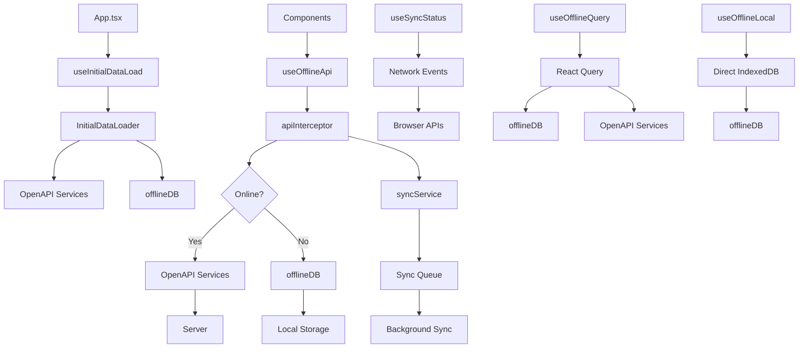
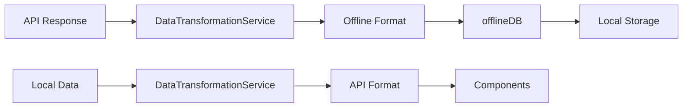
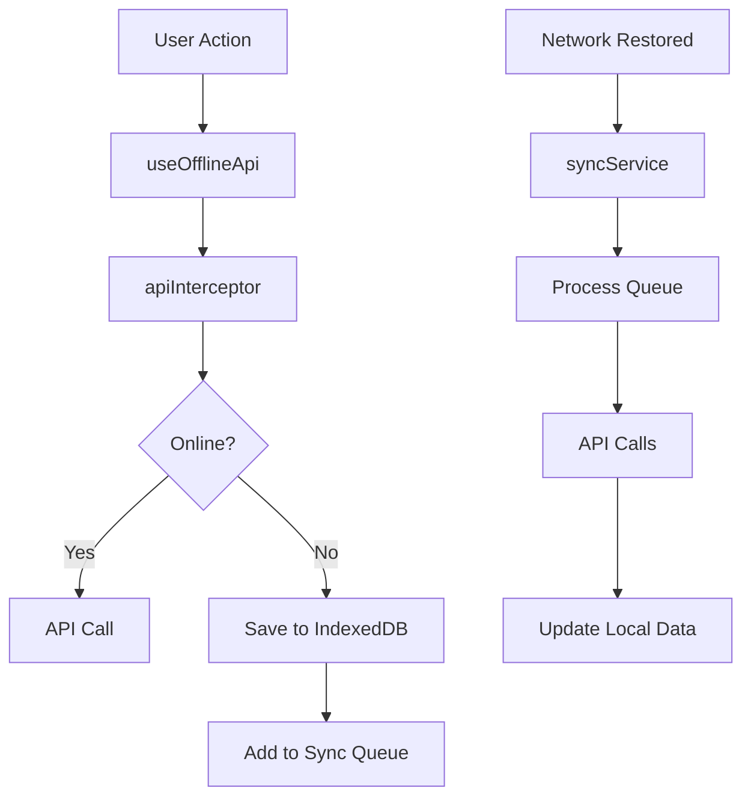

# Offline-First Architecture: Hook Connections and Data Flow

## Overview

This document explains how all the offline hooks in the DGAT Sustainability application are connected and how data flows through the system. The architecture implements a sophisticated offline-first approach with multiple layers of abstraction.

## Architecture Layers

```
┌─────────────────────────────────────────────────────────────┐
│                    COMPONENT LAYER                          │
│  (React Components using hooks)                             │
├─────────────────────────────────────────────────────────────┤
│                    HOOK LAYER                               │
│  useOfflineApi.ts    useOfflineQuery.ts    useOfflineLocal.ts│
│  useInitialDataLoad.ts    useSyncStatus.ts                  │
├─────────────────────────────────────────────────────────────┤
│                   SERVICE LAYER                             │
│  apiInterceptor.ts   syncService.ts   initialDataLoader.ts  │
│  indexeddb.ts        dataTransformation.ts                  │
├─────────────────────────────────────────────────────────────┤
│                   DATA LAYER                                │
│  IndexedDB (Local)    OpenAPI Services (Remote)             │
└─────────────────────────────────────────────────────────────┘
```

## Hook Dependencies and Connections

### 1. **useSyncStatus.ts** - Foundation Hook

**Location**: `frontend/src/hooks/shared/useSyncStatus.ts`

**Purpose**: Simple network status monitoring
**Dependencies**: None (browser APIs only)
**Used By**:

- `useInitialDataLoad.ts`
- `useOfflineLocal.ts`
- `useOffline.ts`
- `SyncStatusIndicator.tsx`

**Flow**:

```typescript
// Simple state management
const [isOnline, setIsOnline] = useState(navigator.onLine);
// Listens to browser online/offline events
// Returns: { isOnline: boolean }
```

### 2. **useInitialDataLoad.ts** - App Startup Orchestrator

**Location**: `frontend/src/hooks/useInitialDataLoad.ts`

**Purpose**: Manages initial data loading when app starts
**Dependencies**:

- `useAuth` (authentication)
- `useSyncStatus` (network status)
- `InitialDataLoader` service
- `offlineDB` service

**Used By**:

- `App.tsx` (main app component)
- `Dashboard.tsx` (user dashboard)

**Flow**:

```typescript
// 1. Check authentication
const { isAuthenticated, user, roles } = useAuth();

// 2. Check network status
const { isOnline } = useSyncStatus();

// 3. Load data based on user role
const loader = new InitialDataLoader();
await loader.loadAllData(userContext);

// 4. Track progress
const progress = await loader.getProgress();
```

### 3. **useOfflineApi.ts** - Main Business Logic Layer

**Location**: `frontend/src/hooks/useOfflineApi.ts`

**Purpose**: High-level business hooks with offline-first behavior
**Dependencies**:

- `apiInterceptor` service
- `offlineDB` service
- `DataTransformationService`
- `syncService`
- OpenAPI-generated services

**Used By** (extensively):

- `ManageQuestions.tsx`
- `Dashboard.tsx`
- `AssessmentList.tsx`
- `ManageOrganizations.tsx`
- `ActionPlan.tsx`
- `ReviewAssessments.tsx`
- `ManageCategories.tsx`
- `AdminDashboard.tsx`
- `SubmissionView.tsx`
- `Assessments.tsx`
- `OrgUserManageUsers.tsx`
- `Assesment.tsx`

**Flow**:

```typescript
// Example: useOfflineQuestions()
const result = await apiInterceptor.interceptGet(
  () => QuestionsService.getQuestions(), // API call
  () => offlineDB.getAllQuestions(), // Local fallback
  "questions", // Cache key
);
```

### 4. **useOfflineQuery.ts** - React Query Integration

**Location**: `frontend/src/hooks/useOfflineQuery.ts`

**Purpose**: Generic offline-first queries using React Query
**Dependencies**:

- `@tanstack/react-query`
- `offlineDB` service
- `syncService`

**Used By**: Currently not directly imported (appears to be an alternative approach)

**Flow**:

```typescript
// Generic query with offline-first strategy
const query = useQuery({
  queryKey: options.queryKey,
  queryFn: async () => {
    // Try local data first
    const localData = await options.localDataFn();
    if (localData && !isOnline) return localData;

    // Try network if online
    if (isOnline) {
      try {
        return await options.queryFn();
      } catch (error) {
        return localData; // Fallback to local
      }
    }
  },
});
```

### 5. **useOfflineLocal.ts** - Direct Database Access

**Location**: `frontend/src/hooks/useOfflineLocal.ts`

**Purpose**: Direct IndexedDB access without API interception
**Dependencies**:

- `offlineDB` service
- `useSyncStatus`
- `DataTransformationService`
- OpenAPI services (for fallback)

**Used By**: Currently not directly imported (appears to be an alternative approach)

**Flow**:

```typescript
// Direct database access
const questions = await offlineDB.getAllQuestions();
setData({ questions: questions as Question[] });
```

## Service Layer Dependencies

### **apiInterceptor.ts** - Core Offline Logic

**Location**: `frontend/src/services/apiInterceptor.ts`

**Purpose**: Intercepts API calls and provides offline-first behavior
**Dependencies**:

- `offlineDB`
- `DataTransformationService`
- `syncService`
- OpenAPI services

**Used By**:

- `useOfflineApi.ts` (all hooks)

**Key Methods**:

- `interceptGet()` - Handles GET requests
- `interceptMutation()` - Handles POST/PUT/DELETE requests
- `processQueue()` - Processes pending sync operations

### **indexeddb.ts** - Local Database

**Location**: `frontend/src/services/indexeddb.ts`

**Purpose**: IndexedDB wrapper for local data storage
**Dependencies**: `idb` library

**Used By**:

- `useOfflineApi.ts`
- `useOfflineQuery.ts`
- `useOfflineLocal.ts`
- `useInitialDataLoad.ts`
- `apiInterceptor.ts`
- `syncService.ts`
- `initialDataLoader.ts`

### **syncService.ts** - Synchronization Engine

**Location**: `frontend/src/services/syncService.ts`

**Purpose**: Handles bidirectional sync between server and local data
**Dependencies**:

- `offlineDB`
- `DataTransformationService`
- OpenAPI services

**Used By**:

- `useOfflineApi.ts`
- `useOfflineQuery.ts`
- `apiInterceptor.ts`

### **initialDataLoader.ts** - Data Loading Orchestrator

**Location**: `frontend/src/services/initialDataLoader.ts`

**Purpose**: Loads initial data based on user roles
**Dependencies**:

- `offlineDB`
- `DataTransformationService`
- OpenAPI services

**Used By**:

- `useInitialDataLoad.ts`

## Complete Data Flow Diagram



## Component Usage Patterns

### **High-Level Components** (Most Common)

```typescript
// Dashboard.tsx - Uses useOfflineApi for business logic
import {
  useOfflineSubmissions,
  useOfflineReports,
  useOfflineAssessments,
} from "@/hooks/useOfflineApi";

const { data, isLoading, error } = useOfflineSubmissions();
```

### **App-Level Components**

```typescript
// App.tsx - Uses useInitialDataLoad for startup
import { useInitialDataLoad } from "./hooks/useInitialDataLoad";

const { isLoading: dataLoading } = useInitialDataLoad();
```

### **Utility Components**

```typescript
// SyncStatusIndicator.tsx - Uses useSyncStatus for UI
import { useSyncStatus } from "@/hooks/shared/useSyncStatus";

const { isOnline } = useSyncStatus();
```

## Data Transformation Flow



## Sync Flow



## Key Design Patterns

### 1. **Layered Architecture**

- **Components** → **Hooks** → **Services** → **Data**
- Each layer has a specific responsibility
- Clear separation of concerns

### 2. **Offline-First Strategy**

- Always try local data first
- Fallback to API when online
- Queue operations when offline

### 3. **Progressive Enhancement**

- Basic functionality works offline
- Enhanced features when online
- Graceful degradation

### 4. **Role-Based Data Loading**

- Different data sets for different user roles
- Efficient loading based on permissions
- Optimized for user experience

## File Usage Summary

| File                    | Primary Purpose         | Used By   | Dependencies               |
| ----------------------- | ----------------------- | --------- | -------------------------- |
| `useSyncStatus.ts`      | Network monitoring      | 4 files   | Browser APIs               |
| `useInitialDataLoad.ts` | App startup             | 2 files   | Auth, Network, Services    |
| `useOfflineApi.ts`      | Business logic          | 12+ files | API Interceptor, Services  |
| `useOfflineQuery.ts`    | React Query integration | 0 files   | React Query, Services      |
| `useOfflineLocal.ts`    | Direct DB access        | 0 files   | IndexedDB, Services        |
| `apiInterceptor.ts`     | API interception        | 1 file    | IndexedDB, Sync, Transform |
| `indexeddb.ts`          | Local database          | 7 files   | IDB library                |
| `syncService.ts`        | Data synchronization    | 3 files   | IndexedDB, API Services    |
| `initialDataLoader.ts`  | Data loading            | 1 file    | IndexedDB, API Services    |

## Conclusion

The offline-first architecture is built around **useOfflineApi.ts** as the primary interface for components, with **useInitialDataLoad.ts** handling app startup, and **useSyncStatus.ts** providing network awareness. The system provides seamless offline functionality while maintaining data consistency through sophisticated synchronization mechanisms.
